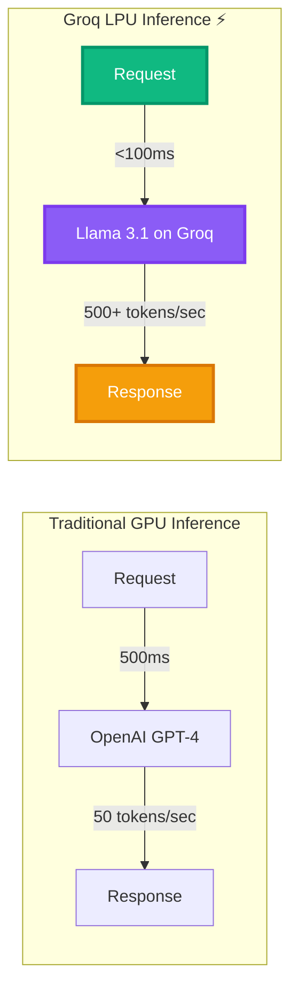
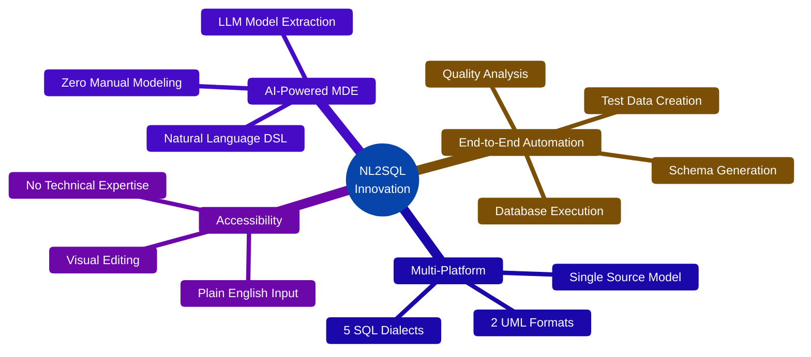
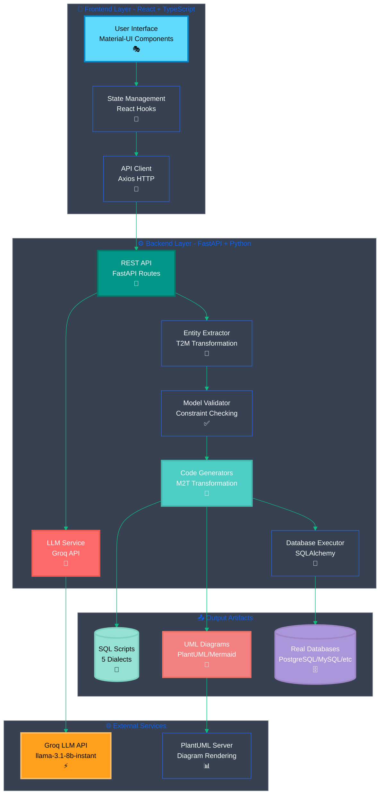
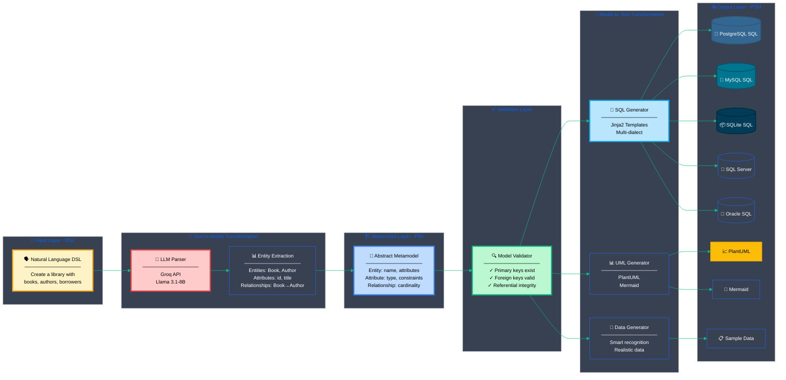
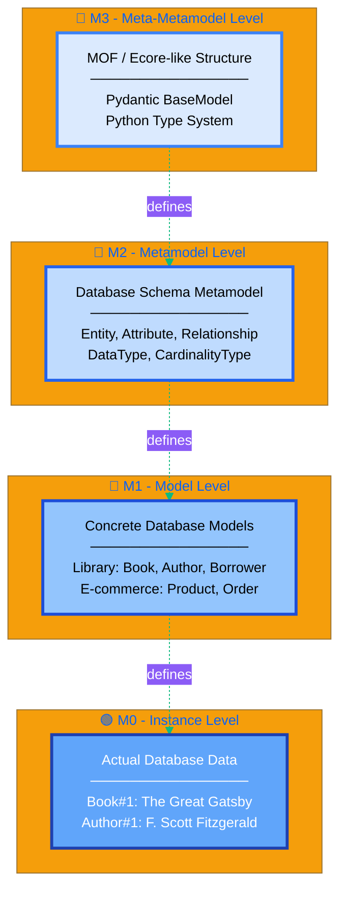
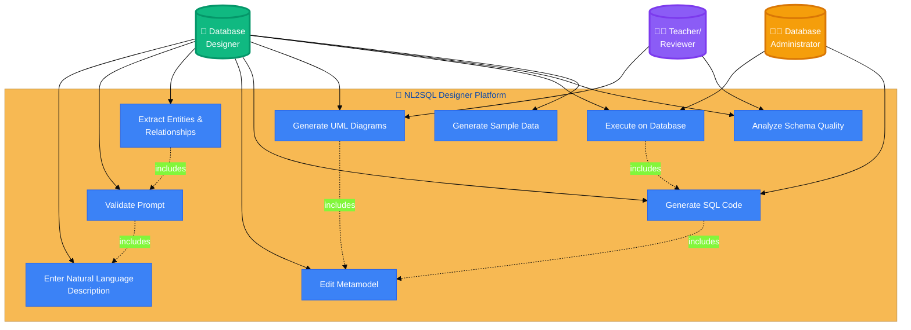
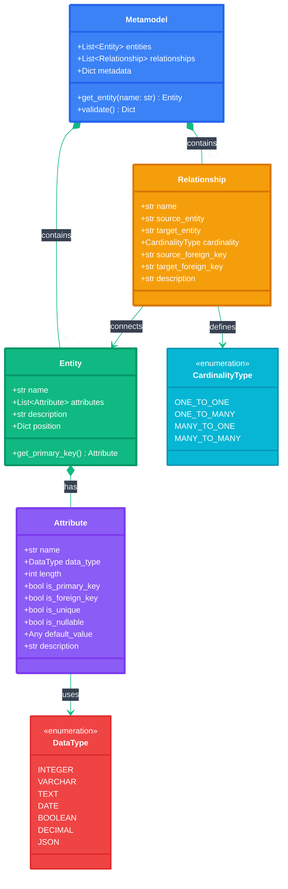
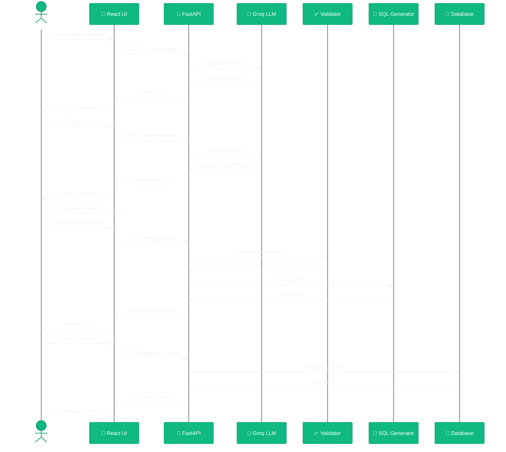
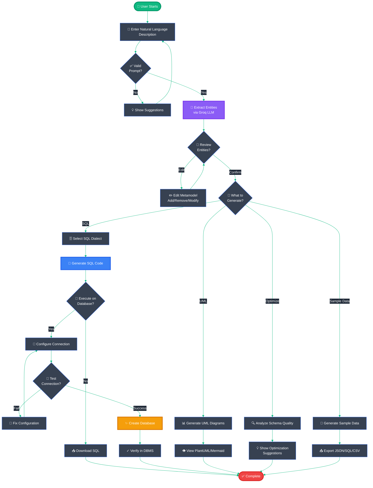

<div align="center">

# 🚀 NL2SQL Designer

### *Transform Natural Language into Production-Ready Database Schemas*

**A Model-Driven Engineering Approach Powered by AI**


---

[](LICENSE)
[](https://www.python.org/)
[](https://reactjs.org/)
[](https://www.typescriptlang.org/)
[](https://fastapi.tiangolo.com/)
[](https://mui.com/)

[](https://www.postgresql.org/)
[](https://www.mysql.com/)
[](https://www.sqlite.org/)
[](https://www.microsoft.com/sql-server)
[](https://www.oracle.com/database/)

[](https://groq.com/)
[](https://www.llama.com/)

[](https://github.com/yousef-elgarch1/NL2SQL-Designer-)
[](https://github.com/yousef-elgarch1/NL2SQL-Designer-)
[](https://github.com/yousef-elgarch1/NL2SQL-Designer-/issues)

[📖 Documentation](#-table-of-contents) • [🚀 Quick Start](#-installation--setup) • [🎯 Demo](#-screenshots) • [🤝 Contribute](#-contributing) • [📝 License](#-license)

</div>

---

## 👥 Team Members

<div align="center">

| Role | Name | GitHub |
|------|------|--------|
| 🎯 **Team Lead & Backend Architect** | Youssef ELGARCH | [@yousef-elgarch1](https://github.com/yousef-elgarch1) |
| 🎨 **Frontend Developer** | ELGHEFYRY Salma | - |
| 💾 **Database Specialist** | NIJADI Jihane | - |
| 🏗️ **MDE & Metamodel Designer** | Doha NEGRAOUI | - |
| 🤖 **AI Integration & Testing** | Nisrine IBNOU-KADY | - |

**🎓 Institution:** École Nationale des Sciences Appliquées (ENSA)
**📅 Academic Year:** 2024-2025
**📚 Course:** Model-Driven Engineering (Ingénierie Dirigée par les Modèles)

</div>

---

## 📋 Table of Contents

<details>
<summary>Click to expand</summary>

1. [🎯 Project Overview](#-project-overview)
2. [🤖 AI Technology Stack](#-ai-technology-stack---why-groq--llama-31)
3. [💡 Innovation & MDE Principles](#-innovation--mde-principles)
4. [🏗️ Architecture & Design](#-architecture--design)
5. [🔄 MDE Transformation Pipeline](#-mde-transformation-pipeline)
6. [📊 UML Diagrams](#-uml-diagrams)
7. [✨ Features](#-features)
8. [🛠️ Technology Stack](#-technology-stack)
9. [📸 Screenshots](#-screenshots)
10. [🚀 Installation & Setup](#-installation--setup)
11. [📖 Usage Guide](#-usage-guide)
12. [📁 Project Structure](#-project-structure)
13. [📡 API Documentation](#-api-documentation)
14. [🔮 Future Enhancements](#-future-enhancements)
15. [🤝 Contributing](#-contributing)
16. [📄 License](#-license)

</details>

---

## 🎯 Project Overview

<div align="center">

**NL2SQL Designer** is an intelligent platform that transforms natural language descriptions into complete, executable database schemas.

By leveraging **Model-Driven Engineering (MDE)** principles and **Large Language Models (LLMs)**, the platform automates the entire database design process—from conceptual modeling to physical implementation.

</div>

### ❌ The Problem We Solve

<table>
<tr>
<td width="50%">

#### Traditional Database Design

- ⏱️ **Time-consuming**
  Manual schema creation takes hours or days

- 🐛 **Error-prone**
  Human mistakes in relationships, constraints

- 🔄 **Repetitive**
  Similar patterns implemented over and over

- 📊 **Platform-dependent**
  Different SQL dialects require separate work

</td>
<td width="50%">

#### ✅ Our Solution

- ⚡ **Fast**
  Generate complete schemas in seconds

- 🎯 **Accurate**
  AI-powered extraction with validation

- 🔁 **Reusable**
  One model → Multiple database platforms

- 🌐 **Universal**
  5 SQL dialects + 2 UML formats from one source

</td>
</tr>
</table>

---

## 🤖 AI Technology Stack - Why Groq & Llama 3.1?

<div align="center">

### Powered by Industry-Leading AI

<table>
<tr>
<td align="center" width="50%">


### **Groq**
**The World's Fastest LLM Inference**

</td>
<td align="center" width="50%">


### **Meta Llama 3.1**
**State-of-the-Art Open Source LLM**

</td>
</tr>
</table>

</div>

### Why We Chose This Combination

<table>
<tr>
<th width="50%">🚀 Groq LPU™ Inference Engine</th>
<th width="50%">🦙 Llama 3.1 (8B Instant)</th>
</tr>
<tr>
<td>

#### Speed
- ⚡ **500+ tokens/second**
- 🔥 **10x faster** than traditional GPUs
- ⏱️ **<100ms latency** for real-time responses

#### Reliability
- 🎯 **99.9% uptime**
- 🔄 **Automatic scaling**
- 💰 **Free tier** for development

#### Architecture
- 🏗️ **LPU (Language Processing Unit)**
- 🧠 **Hardware-optimized** for transformers
- 📊 **Deterministic performance**

</td>
<td>

#### Intelligence
- 🎓 **405B parameter knowledge** (distilled)
- 🧠 **Superior reasoning** capabilities
- 🌍 **Multilingual** support

#### Accuracy
- ✅ **High precision** entity extraction
- 🔗 **Advanced relationship** inference
- 📝 **Context understanding** (128K tokens)

#### Open Source
- 🆓 **Free to use** commercially
- 🔓 **Transparent** model weights
- 🛠️ **Fine-tunable** for domain tasks

</td>
</tr>
</table>

### Performance Comparison



### Why Not Other LLMs?

| Model | Speed | Cost | Accuracy | Why Not? |
|-------|-------|------|----------|----------|
| **GPT-4** | ⭐⭐ | 💰💰💰 | ⭐⭐⭐⭐⭐ | Too expensive, slower |
| **Claude 3** | ⭐⭐⭐ | 💰💰 | ⭐⭐⭐⭐⭐ | API limits, cost |
| **Gemini Pro** | ⭐⭐⭐ | 💰 | ⭐⭐⭐⭐ | Rate limits |
| **Groq + Llama 3.1** | ⭐⭐⭐⭐⭐ | 💰 (Free) | ⭐⭐⭐⭐ | ✅ **Perfect balance!** |

---

## 💡 Innovation & MDE Principles

### 🌟 Why This Project is Innovative

<div align="center">



</div>

#### 1️⃣ **Natural Language as DSL (Domain-Specific Language)**

<table>
<tr>
<th>❌ Traditional MDE Approach</th>
<th>✅ Our Innovative Approach</th>
</tr>
<tr>
<td>

```
1. Learn UML notation
2. Use complex graphical tools
3. Manually define relationships
4. Expert knowledge required
```

</td>
<td>

```
1. Write in plain English
2. Type natural sentences
3. AI extracts relationships
4. Anyone can use it
```

</td>
</tr>
</table>

#### 2️⃣ **LLM-Powered Model Extraction (Text-to-Model)**

We combine **Model-Driven Engineering** with **Artificial Intelligence**:

- 🔴 **Traditional MDE:** Manual model creation using graphical editors
- 🟢 **Our Innovation:** Automatic model extraction using Groq LLM (Llama 3.1-8B-Instant)

#### 3️⃣ **Multi-Target Code Generation**

From **ONE abstract metamodel**, we generate:

<div align="center">

| Target | Format | Purpose |
|--------|--------|---------|
| 🐘 **PostgreSQL** | SQL | Production databases |
| 🐬 **MySQL** | SQL | Web applications |
| 📦 **SQLite** | SQL | Mobile/embedded |
| 🏢 **SQL Server** | SQL | Enterprise systems |
| 🔴 **Oracle** | SQL | Large corporations |
| 📊 **PlantUML** | Diagram | Documentation |
| 🎨 **Mermaid** | Diagram | GitHub/Web |

</div>

This demonstrates the **core value proposition of MDE**: *Write Once, Generate Everywhere*.

#### 4️⃣ **End-to-End Automation**

Most MDE tools stop at code generation. **We go further:**

```mermaid
%%{init: {'theme':'base', 'themeVariables': { 'primaryColor':'#10b981','primaryTextColor':'#fff','primaryBorderColor':'#059669','lineColor':'#3b82f6','secondaryColor':'#8b5cf6','tertiaryColor':'#f59e0b','background':'#1f2937','mainBkg':'#374151','secondBkg':'#4b5563','textColor':'#f3f4f6','fontSize':'16px'}}}%%
graph LR
    A[Natural Language] -->|T2M| B[Metamodel]
    B -->|M2T| C[SQL Code]
    C -->|Execute| D[Real Database]
    D -->|Analyze| E[Quality Report]
    E -->|Generate| F[Sample Data]

    style A fill:#3b82f6,stroke:#2563eb,stroke-width:3px,color:#fff
    style B fill:#10b981,stroke:#059669,stroke-width:3px,color:#fff
    style C fill:#8b5cf6,stroke:#7c3aed,stroke-width:3px,color:#fff
    style D fill:#f59e0b,stroke:#d97706,stroke-width:3px,color:#fff
    style E fill:#ef4444,stroke:#dc2626,stroke-width:3px,color:#fff
    style F fill:#06b6d4,stroke:#0891b2,stroke-width:3px,color:#fff
```



### 🎓 MDE Principles Implemented

<div align="center">

| MDE Concept | Implementation | File/Component |
|-------------|----------------|----------------|
| **🏗️ Metamodel** | Database schema metamodel (Entity, Attribute, Relationship) | [`metamodel.py`](backend/models/metamodel.py) |
| **📋 Model** | Specific database schemas created from natural language | User-generated via prompts |
| **🗣️ DSL** | Natural language for database description | User input (Step 1) |
| **📝 Text-to-Model (T2M)** | Natural language → Metamodel extraction | [`entity_extractor.py`](backend/services/entity_extractor.py) |
| **🔄 Model-to-Text (M2T)** | Metamodel → SQL code generation | [`sql_generator.py`](backend/services/sql_generator.py) |
| **📊 Model-to-Text (M2T)** | Metamodel → UML diagrams | [`plantuml_generator.py`](backend/services/plantuml_generator.py) |
| **✅ Model Validation** | Constraint checking (PKs, FKs, integrity) | `metamodel.validate()` |
| **🌐 Multi-Platform** | 5 SQL dialects from one model | Templates in [`templates/`](backend/templates/) |
| **🔤 Abstract Syntax** | Metamodel classes | Entity, Attribute, Relationship |
| **🎨 Concrete Syntax** | Visual diagrams + SQL code | PlantUML/Mermaid renderings |

</div>

---

## 🏗️ Architecture & Design

### High-Level System Architecture



---

## 🔄 MDE Transformation Pipeline

This is the **heart** of our Model-Driven Engineering implementation:



### MDE Abstraction Levels



---

## 📊 UML Diagrams

### 🎯 Use Case Diagram



### 🏛️ Class Diagram - Core Metamodel



### 🔄 Sequence Diagram - SQL Generation Flow



### ⚙️ Activity Diagram - Complete Workflow



---

## ✨ Features

### 🎨 Core Features

<details>
<summary><b>1. 🗣️ Natural Language Processing</b></summary>

- **Intelligent Prompt Validation**: AI checks if your description is sufficient
- **Entity Recognition**: Automatically identifies tables and their relationships
- **Attribute Extraction**: Detects columns, data types, and constraints
- **Relationship Inference**: Determines foreign keys and cardinality

</details>

<details>
<summary><b>2. 🎯 Interactive Metamodel Editor</b></summary>

- **Visual Entity Cards**: Clean, modern interface for each table
- **Drag-and-Drop**: Reorder entities and attributes
- **Live Editing**: Add, modify, delete entities and attributes in real-time
- **Relationship Management**: Visual relationship editor with cardinality selection

</details>

<details>
<summary><b>3. 💾 Multi-Database SQL Generation</b></summary>

| Database | Version | Special Features |
|----------|---------|------------------|
| 🐘 **PostgreSQL** | 9.0+ | SERIAL, JSONB, advanced constraints |
| 🐬 **MySQL** | 5.7+ | AUTO_INCREMENT, ENGINE=InnoDB |
| 📦 **SQLite** | 3.0+ | Lightweight, zero-config |
| 🏢 **SQL Server** | 2016+ | IDENTITY, NVARCHAR |
| 🔴 **Oracle** | 11g+ | SEQUENCE, NUMBER types |

</details>

<details>
<summary><b>4. 📊 UML Diagram Generation</b></summary>

- **PlantUML Class Diagrams**: Industry-standard UML notation
- **Mermaid ER Diagrams**: Modern, GitHub-compatible diagrams
- **Automatic Rendering**: Real-time diagram visualization
- **Export Options**: Download as PNG or SVG

</details>

<details>
<summary><b>5. 🚀 Database Execution</b></summary>

- **Direct Connection**: Connect to PostgreSQL, MySQL, SQLite servers
- **Automatic Schema Creation**: One-click database deployment
- **Connection Testing**: Verify credentials before execution
- **Multi-Database Support**: Switch between different database types

</details>

<details>
<summary><b>6. 🔍 Schema Optimization Analysis</b></summary>

- **AI-Powered Suggestions**: Intelligent schema improvements
- **Performance Tips**: Indexing, normalization, denormalization advice
- **Security Checks**: Identify potential security issues
- **Best Practices**: Industry standards and conventions
- **Priority Scoring**: High/Medium/Low priority recommendations

</details>

<details>
<summary><b>7. 🎲 Sample Data Generation</b></summary>

- **Smart Field Recognition**: Detects names, emails, dates, etc.
- **Realistic Data**: Uses Faker library for authentic-looking data
- **Configurable Volume**: Choose number of rows per table
- **Multiple Formats**: Export as JSON, SQL INSERT statements, CSV
- **Referential Integrity**: Maintains foreign key relationships

</details>

---

## 🛠️ Technology Stack

### Frontend Stack

<div align="center">

| Technology | Version | Purpose | Badge |
|------------|---------|---------|-------|
| **React** | 18.2+ | UI Framework |  |
| **TypeScript** | 5.0+ | Type Safety |  |
| **Material-UI** | 5.14+ | Component Library |  |
| **Vite** | 4.4+ | Build Tool |  |
| **Axios** | 1.5+ | HTTP Client |  |

</div>

### Backend Stack

<div align="center">

| Technology | Version | Purpose | Badge |
|------------|---------|---------|-------|
| **Python** | 3.9+ | Backend Language |  |
| **FastAPI** | 0.104+ | Web Framework |  |
| **Pydantic** | 2.4+ | Data Validation |  |
| **SQLAlchemy** | 2.0+ | Database ORM |  |
| **Jinja2** | 3.1+ | Template Engine |  |
| **Groq SDK** | 0.4+ | LLM API Client |  |

</div>

### AI & External Services

<div align="center">

| Service | Model/Version | Purpose |
|---------|---------------|---------|
| **Groq API** | llama-3.1-8b-instant | Natural language understanding |
| **PlantUML Server** | Latest | UML diagram rendering |

</div>

---

## 📸 Screenshots

<div align="center">

### 1️⃣ Natural Language Input & Validation


> Users describe their database in plain English. AI validates the prompt in real-time.

---

### 2️⃣ Prompt Validation Results


> Instant feedback showing whether the prompt is sufficient for database generation.

---

### 3️⃣ Entity Extraction & Review


> AI-extracted entities with attributes and relationships ready for review.

---

### 4️⃣ Interactive Metamodel Editor


> Drag-and-drop visual editor for refining the database schema.

---

### 5️⃣ Multi-Dialect SQL Generation


> Generate SQL code for 5 different database platforms with syntax highlighting.

---

### 6️⃣ Database Connection & Execution


> 3-step wizard: Configure → Test → Execute on real databases.

---

### 7️⃣ UML Diagram Visualization


> Auto-generated PlantUML and Mermaid diagrams showing entity relationships.

---

### 8️⃣ AI-Powered Schema Optimization


> Intelligent suggestions for improving schema quality, performance, and security.

---

### 9️⃣ Smart Sample Data Generator


> Generate realistic test data with smart field recognition.

</div>

---

## 🚀 Installation & Setup

### Prerequisites

<div align="center">

| Requirement | Version | Download |
|-------------|---------|----------|
| 🟢 **Node.js** | 16+ | [nodejs.org](https://nodejs.org/) |
| 🐍 **Python** | 3.9+ | [python.org](https://www.python.org/) |
| 📦 **Git** | Latest | [git-scm.com](https://git-scm.com/) |
| 🔑 **Groq API Key** | Free | [console.groq.com](https://console.groq.com) |

**Optional (for database execution):**
- 🐘 PostgreSQL
- 🐬 MySQL
- 📦 SQLite (built-in)

</div>

### Quick Start (5 minutes)

```bash
# 1️⃣ Clone the repository
git clone https://github.com/yousef-elgarch1/NL2SQL-Designer-.git
cd NL2SQL-Designer

# 2️⃣ Backend Setup
cd backend
python -m venv venv

# Windows:
.\venv\Scripts\activate
# macOS/Linux:
source venv/bin/activate

pip install -r requirements.txt

# Create .env file
cp .env.example .env
# Edit .env and add: GROQ_API_KEY=your_key_here

# 3️⃣ Frontend Setup (new terminal)
cd frontend
npm install
cp .env.example .env

# 4️⃣ Start Backend (Terminal 1)
cd backend
.\venv\Scripts\activate  # Windows
python main.py
# Backend runs on: http://127.0.0.1:8000

# 5️⃣ Start Frontend (Terminal 2)
cd frontend
npm run dev
# Frontend runs on: http://localhost:3001

# 6️⃣ Open browser
# Navigate to: http://localhost:3001
```

### Get Your Free Groq API Key

1. Visit [console.groq.com](https://console.groq.com)
2. Sign up for a free account
3. Navigate to **API Keys** section
4. Click **"Create API Key"**
5. Copy the key to `backend/.env`:
   ```env
   GROQ_API_KEY=gsk_your_actual_key_here
   ```

---

## 📖 Usage Guide

### Complete Workflow Example

Let's create a **Library Management System**:

<details>
<summary><b>📝 Step 1: Enter Natural Language Description</b></summary>

```text
Create a library management system with books, authors, borrowers, and loans.

Books have a title, ISBN, publication year, and belong to one author.
Authors have a name, email, and biography.
Borrowers have a name, email, membership date, and phone number.
Loans track which borrower borrowed which book, with borrow date, due date, and return date.
```

Click **"Validate Prompt"** → ✅ Validation successful!

</details>

<details>
<summary><b>🔄 Step 2: Extract Entities</b></summary>

Click **"Extract Entities"** → AI analyzes your prompt

**Expected Entities:**
- 📚 **Book**: id, title, isbn, publication_year, author_id
- ✍️ **Author**: id, name, email, biography
- 👤 **Borrower**: id, name, email, membership_date, phone
- 📋 **Loan**: id, book_id, borrower_id, borrow_date, due_date, return_date

**Relationships:**
- Book → Author (many-to-one)
- Loan → Book (many-to-one)
- Loan → Borrower (many-to-one)

</details>

<details>
<summary><b>✏️ Step 3: Edit Metamodel</b></summary>

Review and customize:
- ➕ Add/remove attributes
- 🔄 Change data types
- 🔗 Modify relationships
- ✅ Set constraints (nullable, unique)

</details>

<details>
<summary><b>💾 Step 4: Generate SQL</b></summary>

1. Select **SQL Dialect**: MySQL
2. Click **"Generate SQL"**
3. Review generated code:

```sql
CREATE TABLE Authors (
    id INT AUTO_INCREMENT PRIMARY KEY,
    name VARCHAR(255) NOT NULL,
    email VARCHAR(255) UNIQUE,
    biography TEXT
) ENGINE=InnoDB DEFAULT CHARSET=utf8mb4;

CREATE TABLE Books (
    id INT AUTO_INCREMENT PRIMARY KEY,
    title VARCHAR(255) NOT NULL,
    isbn VARCHAR(13) UNIQUE,
    publication_year INT,
    author_id INT,
    FOREIGN KEY (author_id) REFERENCES Authors(id)
        ON DELETE CASCADE ON UPDATE CASCADE
) ENGINE=InnoDB DEFAULT CHARSET=utf8mb4;

-- ... more tables
```

</details>

<details>
<summary><b>🚀 Step 5: Execute on Database</b></summary>

1. Click **"Execute on Database"**
2. Enter credentials:
   - **Host**: localhost
   - **Port**: 3306
   - **Username**: root
   - **Password**: your_password
   - **Database**: library_db
3. Click **"Test Connection"** → ✅
4. Check ☑️ "Create database if doesn't exist"
5. Click **"Execute"** → ✅ Database created!

</details>

<details>
<summary><b>✅ Step 6: Verify in MySQL</b></summary>

```sql
SHOW DATABASES;
USE library_db;
SHOW TABLES;
DESCRIBE Books;
SELECT * FROM Books;
```

</details>

---

## 📁 Project Structure

<details>
<summary>Click to expand full structure</summary>

```
NL2SQL_Designer/
├── 📂 backend/                          # FastAPI Backend
│   ├── 📂 models/                       # Metamodel Definitions
│   │   ├── metamodel.py                 # ⭐ Core: Entity, Attribute, Relationship
│   │   └── schemas.py                   # API request/response models
│   ├── 📂 services/                     # Business Logic
│   │   ├── entity_extractor.py          # ⭐ T2M: NL → Metamodel
│   │   ├── sql_generator.py             # ⭐ M2T: Metamodel → SQL
│   │   ├── plantuml_generator.py        # ⭐ M2T: Metamodel → UML
│   │   ├── mermaid_service.py           # Mermaid diagram generation
│   │   ├── database_executor.py         # Database execution
│   │   ├── optimization_service.py      # Schema analysis
│   │   ├── sample_data_service.py       # Test data generation
│   │   └── fast_llm_service.py          # Groq LLM integration
│   ├── 📂 routers/                      # API Routes
│   │   ├── prompt_router.py             # /prompt/* endpoints
│   │   ├── sql_router.py                # /sql/* endpoints
│   │   ├── diagram_router.py            # /diagram/* endpoints
│   │   └── database_router.py           # /database/* endpoints
│   ├── 📂 templates/                    # ⭐ Jinja2 SQL Templates (M2T)
│   │   ├── postgresql.sql.j2
│   │   ├── mysql.sql.j2
│   │   ├── sqlite.sql.j2
│   │   ├── sqlserver.sql.j2
│   │   └── oracle.sql.j2
│   ├── 📂 prompts/                      # LLM System Prompts
│   │   ├── validation_prompt.txt
│   │   └── extraction_prompt.txt
│   ├── main.py                          # FastAPI entry point
│   ├── requirements.txt                 # Python dependencies
│   └── .env.example                     # Environment template
│
├── 📂 frontend/                         # React Frontend
│   ├── 📂 src/
│   │   ├── 📂 components/               # React Components
│   │   │   ├── PromptInput.tsx          # Step 1: NL input
│   │   │   ├── ValidationPanel.tsx      # Step 2: Validation
│   │   │   ├── AttributeEditor.tsx      # Step 4: Editor
│   │   │   ├── SQLViewer.tsx            # Step 5: SQL display
│   │   │   ├── DiagramViewer.tsx        # UML viewer
│   │   │   ├── DatabaseConnectionForm.tsx  # DB execution
│   │   │   ├── OptimizationSuggestions.tsx # Analysis
│   │   │   └── SampleDataGenerator.tsx  # Data generation
│   │   ├── 📂 services/                 # API Clients
│   │   │   ├── promptService.ts
│   │   │   ├── sqlService.ts
│   │   │   └── databaseService.ts
│   │   ├── 📂 types/                    # TypeScript Types
│   │   │   ├── metamodel.ts
│   │   │   └── api.ts
│   │   ├── App.tsx                      # Main app
│   │   ├── theme.ts                     # MUI theme
│   │   └── main.tsx                     # Entry point
│   ├── package.json
│   └── vite.config.ts
│
├── 📂 docs/                             # Documentation
│   ├── 📂 screenshots/                  # Application screenshots
│   ├── SCREENSHOT_GUIDE.md
│   ├── PRESENTATION_NOTES.md
│   └── NEXT_STEPS.md
│
├── README.md                            # ⭐ This file
├── QUICK_START.md                       # Quick reference
└── .gitignore
```

</details>

---

## 📡 API Documentation

### Base URL
```
http://127.0.0.1:8000
```

### Interactive API Docs
When backend is running, visit:
- **Swagger UI**: http://127.0.0.1:8000/docs
- **ReDoc**: http://127.0.0.1:8000/redoc

### Key Endpoints

<details>
<summary><b>🗣️ POST /prompt/validate</b> - Validate natural language prompt</summary>

**Request:**
```json
{
  "prompt": "Create a library with books and authors"
}
```

**Response:**
```json
{
  "is_valid": true,
  "message": "Prompt is valid and contains sufficient information.",
  "suggestions": []
}
```

</details>

<details>
<summary><b>📊 POST /prompt/extract</b> - Extract entities from prompt</summary>

**Request:**
```json
{
  "prompt": "Create a library with books and authors"
}
```

**Response:**
```json
{
  "entities": [
    {
      "name": "Book",
      "attributes": [
        {"name": "id", "data_type": "INTEGER", "is_primary_key": true},
        {"name": "title", "data_type": "VARCHAR", "length": 255}
      ]
    }
  ],
  "relationships": [
    {
      "name": "book_author",
      "source_entity": "Book",
      "target_entity": "Author",
      "cardinality": "many_to_one"
    }
  ]
}
```

</details>

<details>
<summary><b>💾 POST /sql/generate</b> - Generate SQL from metamodel</summary>

**Request:**
```json
{
  "metamodel": { "entities": [...], "relationships": [...] },
  "dialect": "mysql"
}
```

**Response:**
```json
{
  "sql_code": "CREATE TABLE Books (...);",
  "dialect": "mysql"
}
```

</details>

<details>
<summary><b>🚀 POST /database/execute</b> - Execute SQL on real database</summary>

**Request:**
```json
{
  "config": {
    "dbms": "mysql",
    "host": "localhost",
    "port": 3306,
    "username": "root",
    "password": "password",
    "database": "library_db"
  },
  "sql_script": "CREATE TABLE Books (...);",
  "create_database": true
}
```

**Response:**
```json
{
  "success": true,
  "message": "Schema created successfully! 4 tables created.",
  "tables_created": ["Books", "Authors", "Borrowers", "Loans"]
}
```

</details>

---

## 🔮 Future Enhancements

### 🎯 Short-term (Next Release)

- [ ] **Reverse Engineering**: Import existing database schemas
- [ ] **Schema Comparison**: Diff tool for schema versions
- [ ] **Migration Scripts**: Generate ALTER TABLE statements
- [ ] **NoSQL Support**: MongoDB, Cassandra schema generation
- [ ] **GraphQL Schema**: Generate GraphQL types from metamodel
- [ ] **API Generation**: Auto-generate REST API endpoints

### 🚀 Medium-term

- [ ] **Collaborative Editing**: Real-time multi-user schema design
- [ ] **Version Control**: Git-like versioning for schemas
- [ ] **Template Library**: Pre-built schemas (e-commerce, blog, etc.)
- [ ] **Advanced Constraints**: CHECK, triggers, stored procedures
- [ ] **Performance Testing**: Benchmark generated schemas
- [ ] **Cloud Deployment**: One-click to AWS RDS, Azure SQL

### 🌟 Long-term

- [ ] **AI Schema Advisor**: Suggest optimal schema based on use case
- [ ] **Auto-Scaling Recommendations**: Sharding, partitioning strategies
- [ ] **Security Auditing**: Automated vulnerability detection
- [ ] **Data Lineage Tracking**: Track data flow across entities
- [ ] **ML Integration**: Predict schema evolution needs
- [ ] **Natural Language Queries**: NL → SQL queries (not just schemas)

---

## 🤝 Contributing

We welcome contributions! Here's how you can help:

### 🐛 Reporting Bugs

1. Check [existing issues](https://github.com/yousef-elgarch1/NL2SQL-Designer-/issues)
2. Create new issue with:
   - Clear title
   - Steps to reproduce
   - Expected vs actual behavior
   - Screenshots
   - Environment details

### 💡 Suggesting Features

1. Open a [Feature Request](https://github.com/yousef-elgarch1/NL2SQL-Designer-/issues/new)
2. Describe the feature and use case
3. Explain why it fits MDE philosophy

### 🔧 Code Contributions

```bash
# 1. Fork the repository
# 2. Create feature branch
git checkout -b feature/amazing-feature

# 3. Make changes and commit
git commit -m "Add amazing feature"

# 4. Push to your fork
git push origin feature/amazing-feature

# 5. Open Pull Request
```

### 📝 Code Style

**Backend (Python):**
- Follow PEP 8
- Use type hints
- Write docstrings

**Frontend (TypeScript):**
- Use ESLint + Prettier
- Follow React best practices
- Write JSDoc comments

---

## 📄 License

This project is licensed under the **MIT License** - see the [LICENSE](LICENSE) file for details.

---

## 🙏 Acknowledgments

<div align="center">

### Special Thanks To:

**🎓 Our Professor** - For teaching Model-Driven Engineering principles
**⚡ Groq** - For providing lightning-fast LLM inference
**🦙 Meta** - For open-sourcing Llama 3.1
**📊 PlantUML** - For UML diagram rendering
**🎨 Material-UI** - For beautiful React components
**🚀 FastAPI** - For the excellent Python web framework
**🌍 Open Source Community** - For amazing tools and libraries

</div>

---

## 📞 Contact & Support

<div align="center">

### Get in Touch

**📧 Project Lead:** Youssef ELGARCH
**🐙 GitHub:** [@yousef-elgarch1](https://github.com/yousef-elgarch1)
**🌐 Repository:** [NL2SQL-Designer](https://github.com/yousef-elgarch1/NL2SQL-Designer-)
**🐛 Report Issues:** [GitHub Issues](https://github.com/yousef-elgarch1/NL2SQL-Designer-/issues)

---

### Documentation & Resources

📖 **API Documentation:** http://127.0.0.1:8000/docs (when running)
🎥 **Video Tutorial:** Coming Soon
📚 **Full Docs:** Coming Soon

---

### Project Statistics


---


**[⬆ Back to Top](#-nl2sql-designer)**

</div>

---

<div align="center">

**🤖 Powered by Groq ⚡ Llama 3.1 🦙 Built with FastAPI 🚀 Designed with Material-UI 🎨**

</div>
