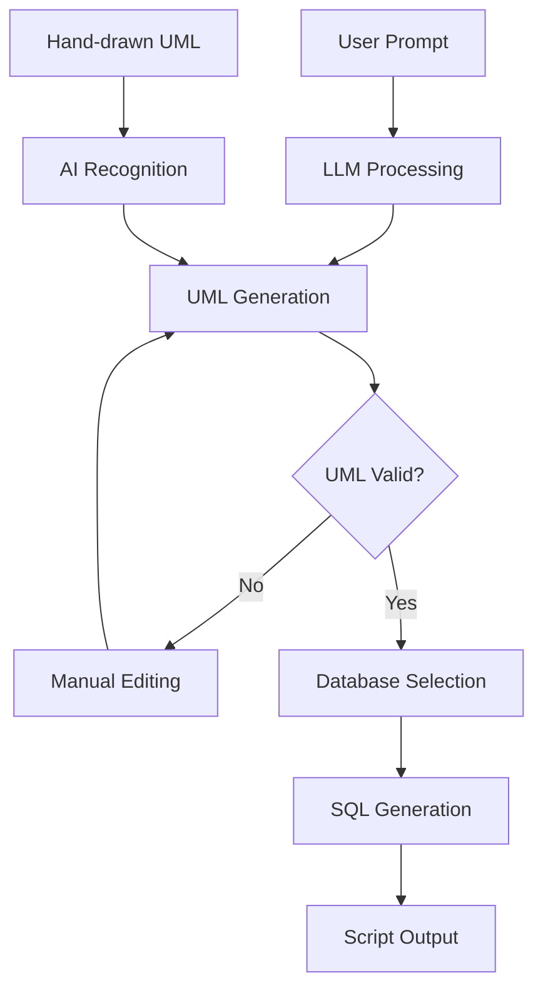

# 🗄️ SchemaForge AI
## AI-Powered Database Schema Generator with Model-Driven Engineering

### 📋 Project Overview

SchemaForge AI is an intelligent system that transforms natural language descriptions into production-ready database schemas through automated UML diagram generation. Built on Model-Driven Engineering (MDE) principles, it bridges the gap between business requirements and technical implementation.

**Key Value Proposition**: From idea to database schema in minutes, not hours.

---

## 🎯 Project Objectives

- **Democratize Database Design**: Enable non-technical stakeholders to participate in schema design
- **Accelerate Development**: Reduce schema design time from hours to minutes
- **Ensure Consistency**: Standardize database design patterns across projects
- **Multi-Platform Support**: Generate optimized SQL for different database engines
- **Visual Validation**: Provide UML diagrams for better understanding and validation

---

## 🏗️ System Architecture

```
┌─────────────────┐    ┌──────────────────┐    ┌─────────────────┐
│   User Input    │    │   LLM Analysis   │    │  UML Generation │
│                 │────│                  │────│                 │
│ Natural Language│    │ Requirements     │    │ ERD/Class       │
│ Prompt          │    │ Extraction       │    │ Diagrams        │
└─────────────────┘    └──────────────────┘    └─────────────────┘
                                                        │
┌─────────────────┐    ┌──────────────────┐    ┌─────────────────┐
│  SQL Scripts    │    │  Engine-Specific │    │ UML Validation  │
│                 │────│                  │────│                 │
│ Multi-Database  │    │ Code Generation  │    │ & Manual Edit   │
│ Support         │    │                  │    │                 │
└─────────────────┘    └──────────────────┘    └─────────────────┘
```

---

## 🔧 Technology Stack

### **Frontend**
- **Framework**: React.js with TypeScript
- **UML Editor**: Joint.js or Fabric.js for interactive diagrams
- **UI Components**: Material-UI or Ant Design
- **State Management**: Redux Toolkit or Zustand

### **Backend**
- **Runtime**: Node.js with Express.js or Python with FastAPI
- **LLM Integration**: 
  - OpenAI GPT-4 API
  - Anthropic Claude API
  - Local models via Ollama (optional)
- **Database**: PostgreSQL for application data storage
- **Template Engine**: Handlebars.js or Jinja2 for SQL generation

### **Model-Driven Engineering**
- **Transformation Engine**: Custom MDE framework
- **Meta-Models**: UML metamodel definitions
- **Code Generation**: Template-based approach with dialect mapping

### **DevOps & Deployment**
- **Containerization**: Docker & Docker Compose
- **Cloud Platform**: AWS/Azure/GCP
- **CI/CD**: GitHub Actions or GitLab CI
- **Monitoring**: Prometheus + Grafana

---
## 🎥 Video Demo

[](https://imagekit.io/player/embed/qpnugvpbj/17.09.2025_14.54.04_REC.mp4?updatedAt=1758117446868&thumbnail=https%3A%2F%2Fik.imagekit.io%2Fqpnugvpbj%2F17.09.2025_14.54.04_REC.mp4%2Fik-thumbnail.jpg%3FupdatedAt%3D1758117446868&updatedAt=1758117446868)

### 📹 Demo Highlights
- **Natural Language to SQL**: See how prompts transform into complete schemas
- **Interactive UML Editor**: Watch real-time diagram generation and editing
- **Multi-Database Support**: Demonstration across PostgreSQL, MySQL, and Oracle
- **End-to-End Workflow**: Complete process from idea to production-ready SQL

*Demo Duration: ~5 minutes | Updated: September 2025*

---

## 🚀 Core Features

### Phase 1: MVP (Months 1-2)
- [ ] Natural language prompt processing
- [ ] Basic UML ERD generation
- [ ] Single database support (PostgreSQL)
- [ ] Simple web interface

### Phase 2: Enhanced UML (Months 3-4)
- [ ] Interactive UML editor
- [ ] Manual diagram editing capabilities
- [ ] UML validation and error checking
- [ ] Export/Import UML diagrams

### Phase 3: Multi-Database (Months 5-6)
- [ ] MySQL support
- [ ] Oracle support
- [ ] SQL Server support
- [ ] Database-specific optimizations

### Phase 4: Advanced Features (Months 7-8)
- [ ] Hand-drawn diagram recognition (Computer Vision)
- [ ] Reverse engineering (DB → UML)
- [ ] Performance optimization suggestions
- [ ] Team collaboration features

---

## 📊 System Workflow



---

## 💡 Example Usage

### Input Prompt:
```
"I need a database for an e-commerce system with users, products, orders, 
and categories. Users can have multiple orders, products belong to categories, 
and orders contain multiple products with quantities."
```

### Generated UML Elements:
- **Entities**: User, Product, Order, Category, OrderItem
- **Relationships**: User(1) → Order(N), Category(1) → Product(N), Order(N) → Product(M)
- **Attributes**: Auto-generated with appropriate data types

### Output SQL (PostgreSQL):
```sql
CREATE TABLE users (
    id SERIAL PRIMARY KEY,
    email VARCHAR(255) UNIQUE NOT NULL,
    created_at TIMESTAMP DEFAULT CURRENT_TIMESTAMP
);

CREATE TABLE categories (
    id SERIAL PRIMARY KEY,
    name VARCHAR(100) NOT NULL
);
-- ... additional tables
```

---

## 🔍 Model-Driven Engineering Benefits

| Traditional Approach | MDE Approach |
|---------------------|--------------|
| Manual schema design | Automated generation |
| Error-prone process | Validation at model level |
| Platform-specific code | Platform-independent models |
| Hard to maintain | Easy model updates |
| Limited reusability | High reusability |

---

## 🎨 UML Diagram Types Supported

### 1. Entity-Relationship Diagrams (ERD)
- Primary focus for database design
- Entity relationships and cardinalities
- Attribute definitions and constraints

### 2. UML Class Diagrams
- Object-oriented approach to database design
- Class relationships and inheritance
- Database stereotypes support

### 3. Database Schema Diagrams
- Table-centric view
- Foreign key relationships
- Index and constraint visualization

---

## 🗃️ Database Engine Support

| Database | Status | Key Features |
|----------|--------|--------------|
| PostgreSQL | ✅ Primary | Advanced data types, JSON support |
| MySQL | 🔄 Planned | MyISAM/InnoDB engines |
| Oracle | 🔄 Planned | Enterprise features, PL/SQL |
| SQL Server | 🔄 Planned | T-SQL specific features |
| SQLite | 🔄 Future | Lightweight applications |

---

## 📁 Project Structure

```
schemaforge-ai/
├── frontend/                 # React application
│   ├── src/components/      # UI components
│   ├── src/services/        # API services
│   └── src/store/           # State management
├── backend/                 # API server
│   ├── src/controllers/     # Request handlers
│   ├── src/services/        # Business logic
│   ├── src/models/          # Data models
│   └── src/templates/       # SQL templates
├── mde-engine/              # Model transformation
│   ├── metamodels/          # UML definitions
│   ├── transformations/     # M2M, M2T rules
│   └── generators/          # Code generators
├── docs/                    # Documentation
└── docker/                 # Containerization
```

---

## 🚀 Getting Started

### Prerequisites
- Node.js 18+ or Python 3.9+
- PostgreSQL 14+
- OpenAI API key
- Git

### Quick Start
```bash
# Clone repository
git clone https://github.com/yourorg/schemaforge-ai.git
cd schemaforge-ai

# Install dependencies
npm install
# or
pip install -r requirements.txt

# Set environment variables
cp .env.example .env
# Add your OpenAI API key

# Start development server
npm run dev
# or
python main.py
```

---

## 🎯 Success Metrics

- **Time Reduction**: 80% faster schema creation
- **Error Reduction**: 60% fewer schema design errors
- **User Adoption**: 90% developer satisfaction rate
- **Coverage**: Support for 4+ database engines
- **Accuracy**: 95% correct UML generation from prompts

---

## 🤝 Team Roles

- **Project Lead**: Overall coordination and architecture
- **Frontend Developer**: React UI and UML editor
- **Backend Developer**: API and LLM integration
- **MDE Engineer**: Model transformations and code generation
- **DevOps Engineer**: Deployment and infrastructure
- **QA Engineer**: Testing and validation

---

## 📅 Project Timeline

| Phase | Duration | Deliverables |
|-------|----------|--------------|
| Phase 1 | 2 months | MVP with basic functionality |
| Phase 2 | 2 months | UML editor and validation |
| Phase 3 | 2 months | Multi-database support |
| Phase 4 | 2 months | Advanced AI features |

---

## 📚 Resources & References

- [Model-Driven Engineering Principles](https://en.wikipedia.org/wiki/Model-driven_engineering)
- [UML Database Modeling Best Practices](https://www.uml-diagrams.org/)
- [SQL Standards Documentation](https://www.iso.org/standard/63555.html)
- [OpenAI API Documentation](https://platform.openai.com/docs)

---

## 📄 License

This project is licensed under the MIT License - see the [LICENSE](LICENSE) file for details.

---

**Ready to transform database design? Let's build the future of schema generation! 🚀**
