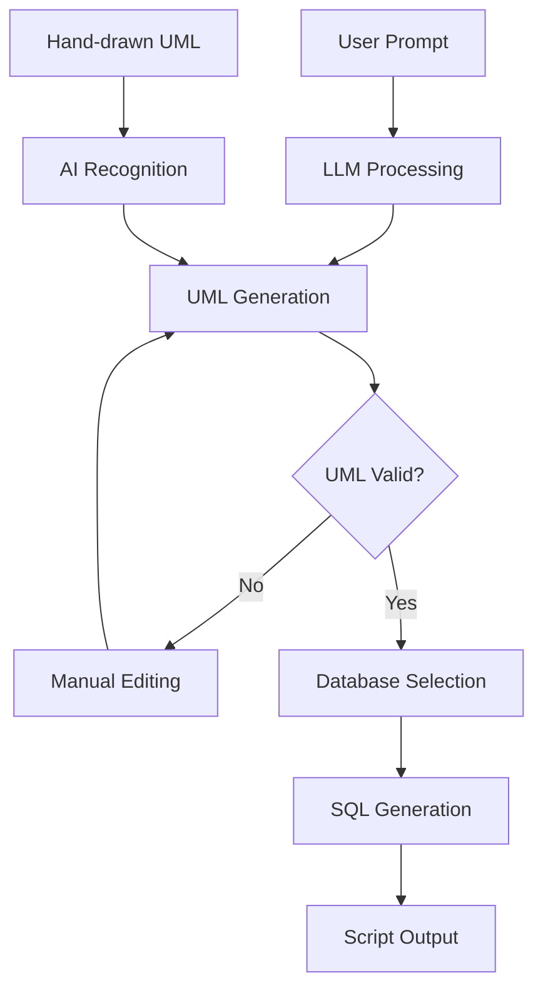

# 🗄️ NL2SQL Desginer AI
## AI-Powered Database Schema Generator with Model-Driven Engineering

### 📋 Project Overview

SchemaForge AI is an intelligent system that transforms natural language descriptions into production-ready database schemas through automated UML diagram generation. Built on Model-Driven Engineering (MDE) principles, it bridges the gap between business requirements and technical implementation.

**Key Value Proposition**: From idea to database schema in minutes, not hours.

---

## 🎯 Project Objectives

- **Democratize Database Design**: Enable non-technical stakeholders to participate in schema design
- **Accelerate Development**: Reduce schema design time from hours to minutes
- **Ensure Consistency**: Standardize database design patterns across projects
- **Multi-Platform Support**: Generate optimized SQL for different database engines
- **Visual Validation**: Provide UML diagrams for better understanding and validation

---

## 🏗️ System Architecture

```
┌─────────────────┐    ┌──────────────────┐    ┌─────────────────┐
│   User Input    │    │   LLM Analysis   │    │  UML Generation │
│                 │────│                  │────│                 │
│ Natural Language│    │ Requirements     │    │ ERD/Class       │
│ Prompt          │    │ Extraction       │    │ Diagrams        │
└─────────────────┘    └──────────────────┘    └─────────────────┘
                                                        │
┌─────────────────┐    ┌──────────────────┐    ┌─────────────────┐
│  SQL Scripts    │    │  Engine-Specific │    │ UML Validation  │
│                 │────│                  │────│                 │
│ Multi-Database  │    │ Code Generation  │    │ & Manual Edit   │
│ Support         │    │                  │    │                 │
└─────────────────┘    └──────────────────┘    └─────────────────┘
```

---
## Pipeline§


## 🔧 Technology Stack

### **Frontend**
- **Framework**: React.js with TypeScript
- **UML Editor**: Joint.js or Fabric.js for interactive diagrams
- **UI Components**: Material-UI or Ant Design
- **State Management**: Redux Toolkit or Zustand

### **Backend**
- **Runtime**: Node.js with Express.js or Python with FastAPI
- **LLM Integration**: 
  - OpenAI GPT-4 API
  - Anthropic Claude API
  - Local models via Ollama (optional)
- **Database**: PostgreSQL for application data storage
- **Template Engine**: Handlebars.js or Jinja2 for SQL generation

### **Model-Driven Engineering**
- **Transformation Engine**: Custom MDE framework
- **Meta-Models**: UML metamodel definitions
- **Code Generation**: Template-based approach with dialect mapping

### **DevOps & Deployment**
- **Containerization**: Docker & Docker Compose
- **Cloud Platform**: AWS/Azure/GCP
- **CI/CD**: GitHub Actions or GitLab CI
- **Monitoring**: Prometheus + Grafana

---
## 🎥 Video Demo

[](https://imagekit.io/player/embed/qpnugvpbj/17.09.2025_14.54.04_REC.mp4?updatedAt=1758117446868&thumbnail=https%3A%2F%2Fik.imagekit.io%2Fqpnugvpbj%2F17.09.2025_14.54.04_REC.mp4%2Fik-thumbnail.jpg%3FupdatedAt%3D1758117446868&updatedAt=1758117446868)

### 📹 Demo Highlights
- **Natural Language to SQL**: See how prompts transform into complete schemas
- **Interactive UML Editor**: Watch real-time diagram generation and editing
- **Multi-Database Support**: Demonstration across PostgreSQL, MySQL, and Oracle
- **End-to-End Workflow**: Complete process from idea to production-ready SQL

*Demo Duration: ~5 minutes | Updated: September 2025*

---

## 🚀 Core Features

### Phase 1: MVP (Months 1-2)
- [ ] Natural language prompt processing
- [ ] Basic UML ERD generation
- [ ] Single database support (PostgreSQL)
- [ ] Simple web interface

### Phase 2: Enhanced UML (Months 3-4)
- [ ] Interactive UML editor
- [ ] Manual diagram editing capabilities
- [ ] UML validation and error checking
- [ ] Export/Import UML diagrams

### Phase 3: Multi-Database (Months 5-6)
- [ ] MySQL support
- [ ] Oracle support
- [ ] SQL Server support
- [ ] Database-specific optimizations

### Phase 4: Advanced Features (Months 7-8)
- [ ] Hand-drawn diagram recognition (Computer Vision)
- [ ] Reverse engineering (DB → UML)
- [ ] Performance optimization suggestions
- [ ] Team collaboration features

---

## 📊 System Workflow



---

## 💡 Example Usage

### Input Prompt:
```
"I need a database for an e-commerce system with users, products, orders, 
and categories. Users can have multiple orders, products belong to categories, 
and orders contain multiple products with quantities."
```

### Generated UML Elements:
- **Entities**: User, Product, Order, Category, OrderItem
- **Relationships**: User(1) → Order(N), Category(1) → Product(N), Order(N) → Product(M)
- **Attributes**: Auto-generated with appropriate data types

### Output SQL (PostgreSQL):
```sql
CREATE TABLE users (
    id SERIAL PRIMARY KEY,
    email VARCHAR(255) UNIQUE NOT NULL,
    created_at TIMESTAMP DEFAULT CURRENT_TIMESTAMP
);

CREATE TABLE categories (
    id SERIAL PRIMARY KEY,
    name VARCHAR(100) NOT NULL
);
-- ... additional tables
```

---

## 🔍 Model-Driven Engineering Benefits

| Traditional Approach | MDE Approach |
|---------------------|--------------|
| Manual schema design | Automated generation |
| Error-prone process | Validation at model level |
| Platform-specific code | Platform-independent models |
| Hard to maintain | Easy model updates |
| Limited reusability | High reusability |

---

## 🎨 UML Diagram Types Supported

### 1. Entity-Relationship Diagrams (ERD)
- Primary focus for database design
- Entity relationships and cardinalities
- Attribute definitions and constraints

### 2. UML Class Diagrams
- Object-oriented approach to database design
- Class relationships and inheritance
- Database stereotypes support

### 3. Database Schema Diagrams
- Table-centric view
- Foreign key relationships
- Index and constraint visualization

---

## 🗃️ Database Engine Support

| Database | Status | Key Features |
|----------|--------|--------------|
| PostgreSQL | ✅ Primary | Advanced data types, JSON support |
| MySQL | 🔄 Planned | MyISAM/InnoDB engines |
| Oracle | 🔄 Planned | Enterprise features, PL/SQL |
| SQL Server | 🔄 Planned | T-SQL specific features |
| SQLite | 🔄 Future | Lightweight applications |

---

## 📁 Project Structure

```
schemaforge-ai/
├── frontend/                 # React application
│   ├── src/components/      # UI components
│   ├── src/services/        # API services
│   └── src/store/           # State management
├── backend/                 # API server
│   ├── src/controllers/     # Request handlers
│   ├── src/services/        # Business logic
│   ├── src/models/          # Data models
│   └── src/templates/       # SQL templates
├── mde-engine/              # Model transformation
│   ├── metamodels/          # UML definitions
│   ├── transformations/     # M2M, M2T rules
│   └── generators/          # Code generators
├── docs/                    # Documentation
└── docker/                 # Containerization
```

---

## 🚀 Getting Started

### Prerequisites
- Node.js 18+ or Python 3.9+
- PostgreSQL 14+
- OpenAI API key
- Git

### Quick Start
```bash
# Clone repository
git clone https://github.com/yourorg/schemaforge-ai.git
cd schemaforge-ai

# Install dependencies
npm install
# or
pip install -r requirements.txt

# Set environment variables
cp .env.example .env
# Add your OpenAI API key

# Start development server
npm run dev
# or
python main.py
```

---

## 🎯 Success Metrics

- **Time Reduction**: 80% faster schema creation
- **Error Reduction**: 60% fewer schema design errors
- **User Adoption**: 90% developer satisfaction rate
- **Coverage**: Support for 4+ database engines
- **Accuracy**: 95% correct UML generation from prompts

---

## 🤝 Team Roles

- **Project Lead**: Overall coordination and architecture
- **Frontend Developer**: React UI and UML editor
- **Backend Developer**: API and LLM integration
- **MDE Engineer**: Model transformations and code generation
- **DevOps Engineer**: Deployment and infrastructure
- **QA Engineer**: Testing and validation

---
# 🔧 Complete Technology Stack & Implementation Plan

## 🛠️ Detailed Technology Stack

### **Frontend Layer**
```javascript
// Core Framework
- React 18+ with TypeScript
- Vite (Build tool) or Create React App
- React Router v6 (Navigation)

// UI Components & Styling
- Tailwind CSS (Utility-first styling)
- Headless UI or Radix UI (Accessible components)
- Lucide React (Icons)
- React Hot Toast (Notifications)

// UML Diagram Editor
- JointJS (Primary UML editor)
- Fabric.js (Alternative drawing canvas)
- React Flow (Node-based diagrams)
- SVG.js (SVG manipulation)

// State Management
- Zustand or Redux Toolkit
- React Query/TanStack Query (Server state)
- React Hook Form (Form handling)

// Utilities
- Axios (HTTP client)
- Date-fns (Date manipulation)
- Lodash (Utility functions)
```

### **Backend Layer**
```python
# Core Framework (Option 1: Python)
- FastAPI (Modern Python web framework)
- Pydantic (Data validation)
- SQLAlchemy (ORM)
- Alembic (Database migrations)

# Alternative: Node.js Stack
- Express.js with TypeScript
- Prisma ORM
- Zod (Schema validation)
- TypeORM
```

```dockerfile
# Containerization
- Docker & Docker Compose
- Multi-stage builds
- Health checks
```

### **AI/LLM Integration**
```python
# LLM APIs
- OpenAI GPT-4 API
- Anthropic Claude API
- Azure OpenAI Service
- Local models via Ollama (optional)

# AI Libraries
- LangChain (LLM orchestration)
- LangSmith (Monitoring)
- tiktoken (Token counting)
- Instructor (Structured outputs)
```

### **Model-Driven Engineering**
```python
# MDE Framework (Custom)
- Metamodel definitions (JSON Schema)
- Model transformation engine
- Template engine (Jinja2)
- Validation engine

# UML Processing
- PlantUML integration
- XMI format support
- EMF (Eclipse Modeling Framework) compatibility
```

### **Database Layer**
```sql
-- Application Database
- PostgreSQL 15+ (Primary)
- Redis (Caching & sessions)

-- Target Database Support
- PostgreSQL
- MySQL 8+
- Oracle 19c+
- SQL Server 2019+
- SQLite (for testing)
```

### **DevOps & Infrastructure**
```yaml
# Cloud Platform
- AWS/Azure/GCP
- Terraform (Infrastructure as Code)
- AWS RDS/Azure Database
- AWS S3/Azure Blob Storage

# CI/CD
- GitHub Actions or GitLab CI
- Docker Hub/AWS ECR
- Automated testing
- Security scanning

# Monitoring
- Prometheus + Grafana
- Sentry (Error tracking)
- OpenTelemetry (Observability)
```

---

## 🚀 Complete Implementation Roadmap

### **Phase 1: Foundation & MVP (Months 1-2)**

#### **Week 1-2: Project Setup**
```bash
# Repository Structure
mkdir schemaforge-ai
cd schemaforge-ai

# Frontend setup
npx create-react-app frontend --template typescript
cd frontend
npm install @tailwindcss/forms @headlessui/react lucide-react
npm install jointjs fabric react-query axios

# Backend setup
cd ../
mkdir backend
cd backend
pip install fastapi uvicorn sqlalchemy alembic
pip install openai anthropic langchain pydantic
```

**Deliverables:**
- [ ] Project repository with CI/CD pipeline
- [ ] Basic React app with Tailwind CSS
- [ ] FastAPI backend with database connection
- [ ] Docker setup for local development
- [ ] Environment configuration

#### **Week 3-4: Core LLM Integration**
```python
# backend/services/llm_service.py
class LLMService:
    def __init__(self):
        self.openai_client = OpenAI()
    
    async def analyze_prompt(self, prompt: str) -> AnalysisResult:
        # Structured prompt for entity extraction
        system_prompt = """
        Extract database entities, attributes, and relationships 
        from the user's description. Return structured JSON.
        """
        # Implementation here
        
    async def generate_uml(self, analysis: AnalysisResult) -> UMLDiagram:
        # Generate UML from analysis
        pass
```

**Deliverables:**
- [ ] LLM prompt engineering for entity extraction
- [ ] Structured output parsing
- [ ] Basic UML data structure
- [ ] API endpoints for prompt processing

#### **Week 5-6: Basic UML Generation**
```javascript
// frontend/components/UMLEditor.tsx
const UMLEditor = () => {
    const [diagram, setDiagram] = useState(null);
    
    useEffect(() => {
        // Initialize JointJS paper
        const graph = new joint.dia.Graph();
        const paper = new joint.dia.Paper({
            el: paperRef.current,
            model: graph,
            width: 800,
            height: 600
        });
    }, []);
    
    // Add entities, relationships
};
```

**Deliverables:**
- [ ] Interactive UML canvas
- [ ] Entity creation and editing
- [ ] Basic relationship drawing
- [ ] UML validation

#### **Week 7-8: PostgreSQL SQL Generation**
```python
# backend/generators/postgresql_generator.py
class PostgreSQLGenerator:
    def generate_table(self, entity: Entity) -> str:
        sql = f"CREATE TABLE {entity.name.lower()}s (\n"
        
        for attr in entity.attributes:
            sql += f"    {attr.name} {self.map_type(attr.type)}"
            if attr.is_primary_key:
                sql += " PRIMARY KEY"
            sql += ",\n"
            
        return sql.rstrip(",\n") + "\n);"
    
    def map_type(self, uml_type: str) -> str:
        type_mapping = {
            "String": "VARCHAR(255)",
            "Integer": "INTEGER",
            "Date": "TIMESTAMP",
            # ... more mappings
        }
        return type_mapping.get(uml_type, "TEXT")
```

**Deliverables:**
- [ ] SQL template engine
- [ ] PostgreSQL-specific generation
- [ ] Foreign key relationships
- [ ] Basic constraints and indexes

---

### **Phase 2: Enhanced UML & Multi-DB (Months 3-4)**

#### **Week 9-10: Advanced UML Editor**
```javascript
// Enhanced UML features
- Drag & drop entity creation
- Property panels for editing
- Relationship types (1:1, 1:N, N:M)
- UML export/import (JSON, XMI)
- Undo/redo functionality
```

**Technical Implementation:**
```javascript
// frontend/hooks/useUMLEditor.ts
export const useUMLEditor = () => {
    const [entities, setEntities] = useState([]);
    const [relationships, setRelationships] = useState([]);
    
    const addEntity = (entity: Entity) => {
        setEntities(prev => [...prev, entity]);
    };
    
    const addRelationship = (rel: Relationship) => {
        setRelationships(prev => [...prev, rel]);
    };
    
    // ... more UML operations
};
```

#### **Week 11-12: Database Engine Abstraction**
```python
# backend/generators/base_generator.py
class BaseGenerator(ABC):
    @abstractmethod
    def generate_table(self, entity: Entity) -> str:
        pass
    
    @abstractmethod
    def generate_constraints(self, relationships: List[Relationship]) -> str:
        pass

# backend/generators/mysql_generator.py
class MySQLGenerator(BaseGenerator):
    def generate_table(self, entity: Entity) -> str:
        # MySQL-specific implementation
        sql = f"CREATE TABLE {entity.name.lower()}s (\n"
        # ... MySQL syntax
        
# backend/generators/oracle_generator.py  
class OracleGenerator(BaseGenerator):
    def generate_table(self, entity: Entity) -> str:
        # Oracle-specific implementation
        pass
```

**Deliverables:**
- [ ] Abstract generator interface
- [ ] MySQL generator implementation
- [ ] Oracle generator implementation
- [ ] SQL Server generator implementation
- [ ] Engine-specific optimizations

#### **Week 13-14: UML Validation & Enhancement**
```python
# backend/validators/uml_validator.py
class UMLValidator:
    def validate_diagram(self, diagram: UMLDiagram) -> ValidationResult:
        errors = []
        warnings = []
        
        # Check for orphaned entities
        # Validate relationship cardinalities
        # Ensure primary keys exist
        # Check for circular dependencies
        
        return ValidationResult(errors, warnings)
```

#### **Week 15-16: Performance & Optimization**
```python
# Caching layer
- Redis for LLM response caching
- Database query optimization
- SQL generation caching
- Frontend bundle optimization
```

---

### **Phase 3: Advanced Features (Months 5-6)**

#### **Week 17-18: Hand-drawn UML Recognition**
```python
# backend/services/vision_service.py
class VisionService:
    def __init__(self):
        self.client = OpenAI()
    
    async def recognize_diagram(self, image_data: bytes) -> UMLDiagram:
        # Use GPT-4 Vision API
        response = await self.client.chat.completions.create(
            model="gpt-4-vision-preview",
            messages=[{
                "role": "user",
                "content": [
                    {"type": "text", "text": "Extract UML entities and relationships"},
                    {"type": "image_url", "image_url": {"url": f"data:image/jpeg;base64,{base64_image}"}}
                ]
            }]
        )
        # Parse response into UMLDiagram
```

**Implementation Steps:**
1. Image upload component
2. Computer vision integration
3. UML structure extraction
4. Diagram reconstruction

#### **Week 19-20: Advanced SQL Features**
```sql
-- Advanced SQL generation features
- Indexes optimization
- Partitioning strategies
- Stored procedures
- Views generation
- Triggers for business logic
- Data migration scripts
```

#### **Week 21-22: Reverse Engineering**
```python
# backend/services/reverse_engineer.py
class ReverseEngineer:
    async def analyze_database(self, connection_string: str) -> UMLDiagram:
        # Connect to existing database
        # Extract schema information
        # Generate UML representation
        # Infer relationships from foreign keys
```

#### **Week 23-24: Team Collaboration**
```javascript
// Real-time collaboration features
- WebSocket integration
- Multi-user editing
- Version control for diagrams
- Comments and annotations
- Export/sharing capabilities
```

---

### **Phase 4: Production & Scale (Months 7-8)**

#### **Week 25-26: Security & Authentication**
```python
# backend/auth/
- JWT authentication
- Role-based access control
- API rate limiting
- Input sanitization
- SQL injection prevention
```

#### **Week 27-28: Testing & Quality**
```python
# Comprehensive testing
- Unit tests (pytest, jest)
- Integration tests
- End-to-end tests (Playwright)
- Performance testing
- Security testing
```

#### **Week 29-30: Deployment & Monitoring**
```yaml
# kubernetes/deployment.yaml
apiVersion: apps/v1
kind: Deployment
metadata:
  name: schemaforge-api
spec:
  replicas: 3
  selector:
    matchLabels:
      app: schemaforge-api
  template:
    spec:
      containers:
      - name: api
        image: schemaforge/api:latest
        ports:
        - containerPort: 8000
```

#### **Week 31-32: Launch & Optimization**
```bash
# Production checklist
- [ ] Load balancer setup
- [ ] Database backups
- [ ] SSL certificates
- [ ] CDN configuration
- [ ] Monitoring dashboards
- [ ] Error alerting
```

---

## 📋 Implementation Checklist by Component

### **Backend API Endpoints**
```python
# Core endpoints to implement
POST   /api/v1/analyze              # Analyze natural language prompt
POST   /api/v1/uml/generate         # Generate UML from analysis
PUT    /api/v1/uml/validate         # Validate UML diagram
POST   /api/v1/sql/generate         # Generate SQL from UML
GET    /api/v1/databases            # List supported databases
POST   /api/v1/vision/recognize     # Recognize hand-drawn diagrams
POST   /api/v1/reverse-engineer     # Reverse engineer existing DB
```

### **Frontend Components**
```javascript
// Component hierarchy
App
├── Header (Navigation, DB selector)
├── Sidebar (Steps, scenarios)
├── Main
│   ├── PromptInput
│   ├── UMLEditor
│   │   ├── Canvas
│   │   ├── Toolbar
│   │   └── PropertyPanel
│   ├── SQLOutput
│   └── ProgressSteps
└── Footer
```

### **Database Schema**
```sql
-- Application database tables
CREATE TABLE projects (
    id UUID PRIMARY KEY,
    name VARCHAR(255) NOT NULL,
    description TEXT,
    created_by UUID NOT NULL,
    created_at TIMESTAMP DEFAULT NOW()
);

CREATE TABLE uml_diagrams (
    id UUID PRIMARY KEY,
    project_id UUID REFERENCES projects(id),
    diagram_data JSONB NOT NULL,
    version INTEGER DEFAULT 1,
    created_at TIMESTAMP DEFAULT NOW()
);

CREATE TABLE generated_sql (
    id UUID PRIMARY KEY,
    diagram_id UUID REFERENCES uml_diagrams(id),
    database_type VARCHAR(50) NOT NULL,
    sql_content TEXT NOT NULL,
    created_at TIMESTAMP DEFAULT NOW()
);
```

---

## 🎯 Success Metrics & KPIs

### **Technical Metrics**
- **API Response Time**: < 2 seconds for SQL generation
- **UML Generation Accuracy**: > 95% correct entities
- **Database Support**: 4+ database engines
- **Uptime**: 99.9% availability

### **User Metrics**
- **Time Reduction**: 80% faster than manual design
- **User Satisfaction**: > 4.5/5 rating
- **Adoption Rate**: 100+ active users in first month
- **Error Reduction**: 60% fewer schema design errors

This comprehensive plan covers everything from initial setup to production deployment, with specific technologies, implementation details, and measurable success criteria.

---
## 📅 Project Timeline

| Phase | Duration | Deliverables |
|-------|----------|--------------|
| Phase 1 | 2 months | MVP with basic functionality |
| Phase 2 | 2 months | UML editor and validation |
| Phase 3 | 2 months | Multi-database support |
| Phase 4 | 2 months | Advanced AI features |

---

## 📚 Resources & References

- [Model-Driven Engineering Principles](https://en.wikipedia.org/wiki/Model-driven_engineering)
- [UML Database Modeling Best Practices](https://www.uml-diagrams.org/)
- [SQL Standards Documentation](https://www.iso.org/standard/63555.html)
- [OpenAI API Documentation](https://platform.openai.com/docs)

---

## 📄 License

This project is licensed under the MIT License - see the [LICENSE](LICENSE) file for details.

---

**Ready to transform database design? Let's build the future of schema generation! 🚀**
