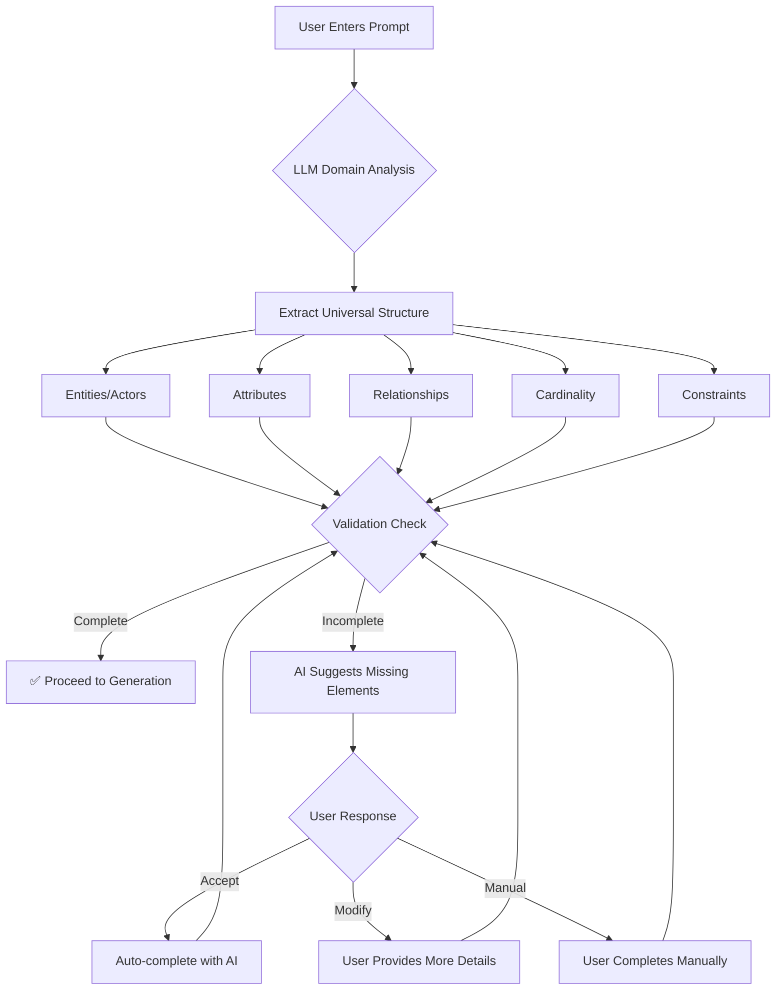
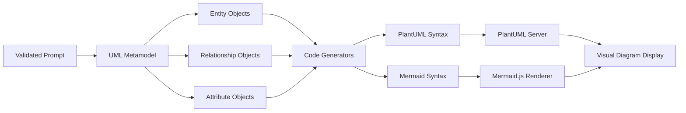
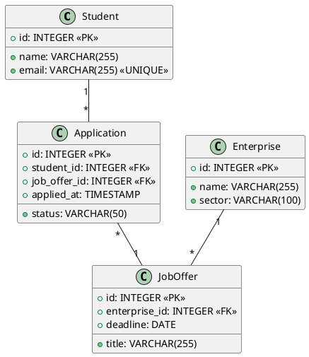
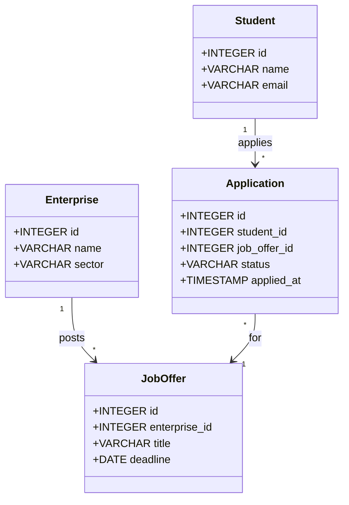
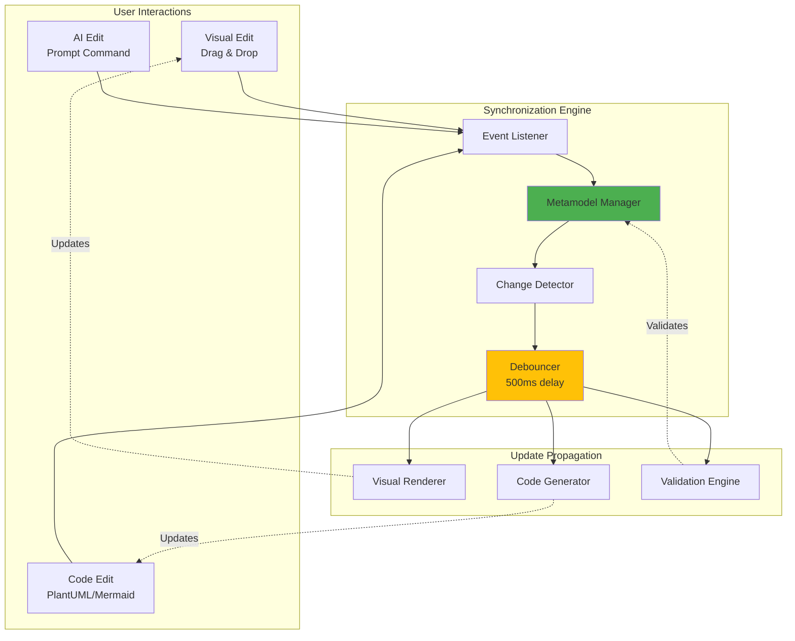
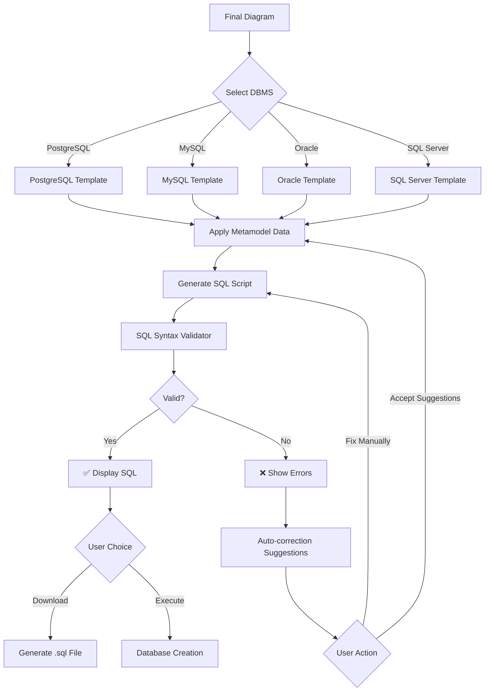
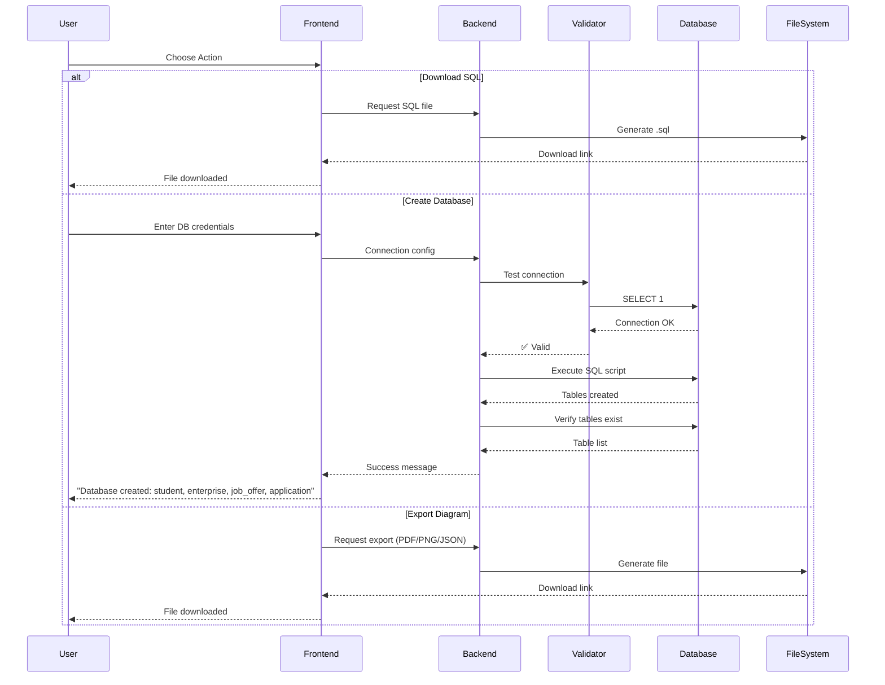

# 🗄️ NL2SQL Generator

## AI-Powered Database Schema Designer with Natural Language Processing

[](https://opensource.org/licenses/MIT)
[](https://www.python.org/downloads/)
[](https://reactjs.org/)
[](https://fastapi.tiangolo.com/)

---

## 📋 Table of Contents

- [Overview](#-overview)
- [Key Features](#-key-features)
- [System Architecture](#-system-architecture)
- [Complete Workflow](#-complete-workflow)
- [Technology Stack](#-technology-stack)
- [LLM Selection](#-llm-selection--reasoning)
- [Installation](#-installation)
- [Usage Guide](#-usage-guide)
- [Project Structure](#-project-structure)
- [Development Roadmap](#-development-roadmap)
- [API Documentation](#-api-documentation)
- [Contributing](#-contributing)
- [License](#-license)

---

## 🎯 Overview

**NL2SQL Generator** is an intelligent system that transforms natural language descriptions into production-ready database schemas through automated diagram generation, real-time editing, and multi-database SQL generation.

### **The Problem**
Traditional database design requires:
- Deep technical knowledge of SQL and data modeling
- Hours of manual schema creation and validation
- Separate tools for diagrams and SQL generation
- Multiple iterations to get it right

### **Our Solution**
```
Natural Language → AI Validation → Visual Diagram → SQL Code → Live Database
     (1 min)            (1 min)         (2 min)        (1 min)      (1 min)
```

**Total Time: ~5 minutes** instead of hours!

---

## ✨ Key Features

### 🧠 **Intelligent Prompt Validation**
- Dynamic domain learning (no pre-defined templates needed)
- Interactive prompt completion with AI suggestions
- Automatic detection of missing entities, attributes, and relationships
- Universal database structure extraction

### 🎨 **Real-Time Visual Editing**
- Three editing modes:
  - 📝 **AI Modification**: Natural language commands
  - 🖱️ **Visual Editor**: Drag-and-drop entities and relationships
  - 💻 **Code Editor**: Direct PlantUML/Mermaid editing
- Bidirectional synchronization (all views stay in sync)
- Live preview of changes

### 🗄️ **Multi-Database Support**
- PostgreSQL (primary)
- MySQL
- Oracle PL/SQL
- SQL Server
- Database-specific optimizations

### ⚡ **Direct Database Deployment**
- In-platform database creation
- Secure connection management
- SQL syntax validation before execution
- Success verification and error handling

### 📤 **Flexible Export Options**
- SQL scripts (.sql)
- PDF documentation with diagrams
- High-resolution images (.png)
- JSON metamodel (.json)
- PlantUML/Mermaid source code

---

## 🏗️ System Architecture

### **High-Level Architecture Diagram**

```
┌─────────────────────────────────────────────────────────────────────────┐
│                          PRESENTATION LAYER                              │
│                     (React + TypeScript + MUI)                          │
├─────────────────────────────────────────────────────────────────────────┤
│                                                                          │
│  ┌─────────────┐  ┌──────────────┐  ┌──────────────┐  ┌─────────────┐ │
│  │   Prompt    │  │   Diagram    │  │     SQL      │  │  Database   │ │
│  │   Input     │  │   Editor     │  │   Viewer     │  │  Connection │ │
│  │  Interface  │  │  (Joint.js)  │  │   (Monaco)   │  │    Form     │ │
│  └─────────────┘  └──────────────┘  └──────────────┘  └─────────────┘ │
│                                                                          │
│  ┌─────────────────────────────────────────────────────────────────┐   │
│  │              Export Manager (SQL/PDF/PNG/JSON)                  │   │
│  └─────────────────────────────────────────────────────────────────┘   │
│                                                                          │
└─────────────────────────────────────────────────────────────────────────┘
                                    ↕️
                            REST API (HTTP/JSON)
                                    ↕️
┌─────────────────────────────────────────────────────────────────────────┐
│                        BUSINESS LOGIC LAYER                              │
│                        (Python + FastAPI)                                │
├─────────────────────────────────────────────────────────────────────────┤
│                                                                          │
│  ┌──────────────────┐  ┌──────────────────┐  ┌──────────────────┐     │
│  │  Prompt          │  │  Diagram         │  │  SQL             │     │
│  │  Validation      │→ │  Generation      │→ │  Generation      │     │
│  │  Engine          │  │  Service         │  │  Templates       │     │
│  └──────────────────┘  └──────────────────┘  └──────────────────┘     │
│                                                                          │
│  ┌──────────────────┐  ┌──────────────────┐  ┌──────────────────┐     │
│  │  Synchronization │  │  SQL Syntax      │  │  Database        │     │
│  │  Engine          │  │  Validator       │  │  Executor        │     │
│  │  (Real-time)     │  │  (sqlparse)      │  │  (SQLAlchemy)    │     │
│  └──────────────────┘  └──────────────────┘  └──────────────────┘     │
│                                                                          │
│  ┌─────────────────────────────────────────────────────────────────┐   │
│  │              Export Service (Multi-format Generator)             │   │
│  └─────────────────────────────────────────────────────────────────┘   │
│                                                                          │
└─────────────────────────────────────────────────────────────────────────┘
                                    ↕️
┌─────────────────────────────────────────────────────────────────────────┐
│                            AI/ML LAYER                                   │
├─────────────────────────────────────────────────────────────────────────┤
│                                                                          │
│  ┌──────────────────────────────────────────────────────────────────┐  │
│  │                   LLM Service (Ollama)                           │  │
│  │                                                                  │  │
│  │  ┌────────────────┐  ┌────────────────┐  ┌──────────────────┐  │  │
│  │  │  Llama 3.1     │  │  Prompt        │  │  Entity          │  │  │
│  │  │  (70B/8B)      │  │  Engineering   │  │  Extraction      │  │  │
│  │  │  Inference     │  │  Templates     │  │  Module          │  │  │
│  │  └────────────────┘  └────────────────┘  └──────────────────┘  │  │
│  │                                                                  │  │
│  │  ┌──────────────────────────────────────────────────────────┐  │  │
│  │  │         Domain Knowledge Base (Dynamic Learning)         │  │  │
│  │  └──────────────────────────────────────────────────────────┘  │  │
│  └──────────────────────────────────────────────────────────────────┘  │
│                                                                          │
└─────────────────────────────────────────────────────────────────────────┘
                                    ↕️
┌─────────────────────────────────────────────────────────────────────────┐
│                       DATA/STORAGE LAYER                                 │
├─────────────────────────────────────────────────────────────────────────┤
│                                                                          │
│  ┌─────────────────┐  ┌──────────────────────────────────────────────┐ │
│  │  SQLite         │  │  User Database Instances                     │ │
│  │  (Sessions)     │  │  (PostgreSQL/MySQL/Oracle/SQL Server)        │ │
│  └─────────────────┘  └──────────────────────────────────────────────┘ │
│                                                                          │
│  ┌─────────────────────────────────────────────────────────────────┐   │
│  │         File System (Exports: SQL/PDF/PNG/JSON/PlantUML)        │   │
│  └─────────────────────────────────────────────────────────────────┘   │
│                                                                          │
└─────────────────────────────────────────────────────────────────────────┘
```

---

## 🔄 Complete Workflow

### **Phase 1: Intelligent Prompt Validation**



**Example Flow:**

```
USER INPUT:
"I want a recruitment system with students and enterprises"

↓

LLM ANALYSIS:
{
  "domain": "recruitment system",
  "detected_entities": ["Student", "Enterprise"],
  "inferred_entities": ["JobOffer", "Application"],
  "missing_info": ["attributes", "relationships"]
}

↓

AI SUGGESTION:
"I detected a recruitment system. Should I add:
 ✓ JobOffer entity (with title, deadline, description)
 ✓ Application entity (linking Students to JobOffers)
 ✓ Typical attributes (name, email, etc.)
 
 Accept all suggestions? [Yes] [No] [Customize]"

↓

USER ACCEPTS → COMPLETE PROMPT READY ✅
```

---

### **Phase 2: Diagram Generation & Rendering**



**Metamodel Structure:**

```python
# Internal representation (not shown to user)
Entity(
    name="Student",
    attributes=[
        Attribute(name="id", type="INTEGER", primary_key=True),
        Attribute(name="name", type="VARCHAR", length=255, not_null=True),
        Attribute(name="email", type="VARCHAR", length=255, unique=True)
    ],
    relationships=[
        Relationship(
            target="Application",
            type="ONE_TO_MANY",
            foreign_key="student_id"
        )
    ]
)
```

**Generated PlantUML:**



**Generated Mermaid:**



---

### **Phase 3: Real-Time Synchronization System**



**Synchronization Flow Example:**

```
USER ACTION: Drag "Student" entity to new position
    ↓
Joint.js emits: "cell:position:change" event
    ↓
Event Listener captures: {entityId: "Student", x: 250, y: 100}
    ↓
Metamodel updates: Student.position = {x: 250, y: 100}
    ↓
Debouncer waits 500ms (no more changes)
    ↓
Code Generator regenerates PlantUML/Mermaid
    ↓
Monaco Editor updates with new code
    ↓
✅ All views synchronized
```

---

### **Phase 4: SQL Generation with Validation**



**SQL Generation Example:**

**For PostgreSQL:**
```sql
-- Generated for PostgreSQL 14+

CREATE TABLE student (
    id SERIAL PRIMARY KEY,
    name VARCHAR(255) NOT NULL,
    email VARCHAR(255) UNIQUE NOT NULL,
    created_at TIMESTAMP DEFAULT CURRENT_TIMESTAMP
);

CREATE TABLE enterprise (
    id SERIAL PRIMARY KEY,
    name VARCHAR(255) NOT NULL,
    sector VARCHAR(100),
    created_at TIMESTAMP DEFAULT CURRENT_TIMESTAMP
);

CREATE TABLE job_offer (
    id SERIAL PRIMARY KEY,
    enterprise_id INTEGER NOT NULL,
    title VARCHAR(255) NOT NULL,
    deadline DATE,
    description TEXT,
    created_at TIMESTAMP DEFAULT CURRENT_TIMESTAMP,
    FOREIGN KEY (enterprise_id) REFERENCES enterprise(id) ON DELETE CASCADE
);

CREATE TABLE application (
    id SERIAL PRIMARY KEY,
    student_id INTEGER NOT NULL,
    job_offer_id INTEGER NOT NULL,
    status VARCHAR(50) DEFAULT 'pending',
    applied_at TIMESTAMP DEFAULT CURRENT_TIMESTAMP,
    FOREIGN KEY (student_id) REFERENCES student(id) ON DELETE CASCADE,
    FOREIGN KEY (job_offer_id) REFERENCES job_offer(id) ON DELETE CASCADE,
    UNIQUE (student_id, job_offer_id)
);

CREATE INDEX idx_job_offer_enterprise ON job_offer(enterprise_id);
CREATE INDEX idx_application_student ON application(student_id);
CREATE INDEX idx_application_job_offer ON application(job_offer_id);
```

**Same Schema for MySQL:**
```sql
-- Generated for MySQL 8.0+

CREATE TABLE student (
    id INT AUTO_INCREMENT PRIMARY KEY,
    name VARCHAR(255) NOT NULL,
    email VARCHAR(255) UNIQUE NOT NULL,
    created_at TIMESTAMP DEFAULT CURRENT_TIMESTAMP
) ENGINE=InnoDB DEFAULT CHARSET=utf8mb4;

CREATE TABLE enterprise (
    id INT AUTO_INCREMENT PRIMARY KEY,
    name VARCHAR(255) NOT NULL,
    sector VARCHAR(100),
    created_at TIMESTAMP DEFAULT CURRENT_TIMESTAMP
) ENGINE=InnoDB DEFAULT CHARSET=utf8mb4;

-- ... rest with MySQL-specific syntax
```

---

### **Phase 5: Database Creation & Export**



**Database Connection Form:**

```
┌────────────────────────────────────────────────────┐
│          Create Database Directly                  │
├────────────────────────────────────────────────────┤
│                                                    │
│  Database Type:  [PostgreSQL ▼]                   │
│                                                    │
│  Host:          [localhost            ]           │
│  Port:          [5432                 ]           │
│  Username:      [postgres             ]           │
│  Password:      [••••••••••           ]           │
│  Database Name: [recruitment_db       ]           │
│                                                    │
│  [Test Connection]  [Create Database]             │
│                                                    │
└────────────────────────────────────────────────────┘
```

---

## 🛠️ Technology Stack

### **Frontend Technologies**

```
┌─────────────────────────────────────────────────────────┐
│                    FRONTEND STACK                       │
├─────────────────────────────────────────────────────────┤
│                                                         │
│  React 18              → UI Framework                   │
│  TypeScript            → Type Safety                    │
│  Material-UI (MUI)     → Component Library             │
│  Joint.js              → Interactive Diagram Editor     │
│  Mermaid.js            → Diagram Rendering             │
│  Monaco Editor         → Code Editor (VS Code engine)   │
│  Axios                 → HTTP Client                    │
│  React Query           → State Management & Caching     │
│  React Router          → Navigation                     │
│  React Dropzone        → File Upload                    │
│                                                         │
└─────────────────────────────────────────────────────────┘
```

### **Backend Technologies**

```
┌─────────────────────────────────────────────────────────┐
│                    BACKEND STACK                        │
├─────────────────────────────────────────────────────────┤
│                                                         │
│  Python 3.11           → Core Language                  │
│  FastAPI               → Web Framework                  │
│  Pydantic              → Data Validation                │
│  SQLAlchemy            → Database ORM                   │
│  Ollama                → Local LLM Inference            │
│  Jinja2                → Template Engine                │
│  sqlparse              → SQL Parser & Validator         │
│  psycopg2              → PostgreSQL Driver              │
│  PyMySQL               → MySQL Driver                   │
│  cx_Oracle             → Oracle Driver                  │
│  ReportLab             → PDF Generation                 │
│  Pillow                → Image Processing               │
│                                                         │
└─────────────────────────────────────────────────────────┘
```

### **AI/ML Stack**

```
┌─────────────────────────────────────────────────────────┐
│                     AI/ML STACK                         │
├─────────────────────────────────────────────────────────┤
│                                                         │
│  Ollama                → LLM Deployment Platform        │
│  Llama 3.1 (70B)       → Primary LLM (Complex tasks)   │
│  Llama 3.1 (8B)        → Secondary LLM (Fast tasks)    │
│  LangChain             → LLM Orchestration (Optional)   │
│                                                         │
└─────────────────────────────────────────────────────────┘
```

### **DevOps & Infrastructure**

```
┌─────────────────────────────────────────────────────────┐
│                  DEVOPS & DEPLOYMENT                    │
├─────────────────────────────────────────────────────────┤
│                                                         │
│  Docker                → Containerization               │
│  Docker Compose        → Multi-container Orchestration  │
│  Nginx                 → Reverse Proxy                  │
│  Git                   → Version Control                │
│  GitHub Actions        → CI/CD Pipeline                 │
│  pytest                → Python Testing                 │
│  Jest + RTL            → React Testing                  │
│  Playwright            → E2E Testing                    │
│                                                         │
└─────────────────────────────────────────────────────────┘
```

---

## 🧠 LLM Selection & Reasoning

### **Chosen LLM: Llama 3.1 (70B) via Ollama**

```
┌──────────────────────────────────────────────────────────┐
│              WHY LLAMA 3.1 OVER ALTERNATIVES?            │
├──────────────────────────────────────────────────────────┤
│                                                          │
│  ✅ FREE & OPEN SOURCE                                   │
│     • No API costs (critical for academic projects)     │
│     • No usage limits or rate limiting                  │
│     • Full control over deployment                      │
│                                                          │
│  ✅ LOCAL DEPLOYMENT                                     │
│     • No internet dependency                            │
│     • Data privacy (no external API calls)              │
│     • Low latency (< 2 seconds for most queries)        │
│                                                          │
│  ✅ LARGE CONTEXT WINDOW (128K tokens)                   │
│     • Handle complex database schemas                   │
│     • Process long user prompts                         │
│     • Maintain conversation history                     │
│                                                          │
│  ✅ STRONG STRUCTURED OUTPUT                             │
│     • Excellent JSON generation                         │
│     • Consistent formatting                             │
│     • Few hallucinations with proper prompting          │
│                                                          │
│  ✅ ACADEMIC-FRIENDLY LICENSE                            │
│     • No commercial restrictions                        │
│     • Can modify and distribute                         │
│     • Suitable for research papers                      │
│                                                          │
└──────────────────────────────────────────────────────────┘
```

### **Comparison with Alternatives**

| Feature | Llama 3.1 | GPT-4 | Claude 3.5 | Mistral 7B |
|---------|-----------|-------|------------|------------|
| **Cost** | ✅ Free | ❌ $0.03/1K | ❌ $0.015/1K | ✅ Free |
| **Local Deploy** | ✅ Yes | ❌ No | ❌ No | ✅ Yes |
| **Context** | ✅ 128K | ✅ 128K | ✅ 200K | ⚠️ 32K |
| **Reasoning** | ✅ Excellent | ✅ Excellent | ✅ Excellent | ⚠️ Good |
| **JSON Output** | ✅ Reliable | ✅ Reliable | ✅ Reliable | ⚠️ Sometimes |
| **Speed** | ⚠️ Medium | ✅ Fast | ✅ Fast | ✅ Very Fast |
| **Size** | ⚠️ 40GB | N/A | N/A | ✅ 4GB |

### **Deployment Strategy**

```
PRIMARY MODEL: Llama 3.1 70B (4-bit quantized)
├─→ Use for: Prompt validation, domain analysis, entity extraction
├─→ RAM Required: ~40GB
└─→ Response Time: 2-5 seconds

FALLBACK MODEL: Llama 3.1 8B (full precision)
├─→ Use for: Quick modifications, simple queries
├─→ RAM Required: ~16GB
└─→ Response Time: <1 second

DEPLOYMENT METHOD: Ollama
├─→ Simple CLI: `ollama run llama3.1:70b`
├─→ REST API: http://localhost:11434
└─→ Model switching: Dynamic based on task complexity
```

---

## 📦 Installation

### **Prerequisites**

```bash
# System Requirements
- RAM: 48GB+ (for Llama 3.1 70B) or 16GB+ (for 8B version)
- GPU: Optional but recommended (NVIDIA with CUDA)
- OS: Linux (Ubuntu 22.04+), macOS, or Windows with WSL2

# Software Requirements
- Python 3.11+
- Node.js 18+
- Docker & Docker Compose
- Git
```

### **Step 1: Clone Repository**

```bash
git clone https://github.com/your-org/nl2sql-generator.git
cd nl2sql-generator
```

### **Step 2: Install Ollama & Download Model**

```bash
# Install Ollama
curl -fsSL https://ollama.com/install.sh | sh

# Download Llama 3.1 (70B - recommended for production)
ollama pull llama3.1:70b

# OR download 8B version (faster, less accurate)
ollama pull llama3.1:8b

# Verify installation
ollama list
```

### **Step 3: Backend Setup**

```bash
cd backend

# Create virtual environment
python3.11 -m venv venv
source venv/bin/activate  # On Windows: venv\Scripts\activate

# Install dependencies
pip install -r requirements.txt

# Set environment variables
cp .env.example .env
# Edit .env with your configurations

# Run backend
uvicorn main:app --reload --host 0.0.0.0 --port 8000
```

### **Step 4: Frontend Setup**

```bash
cd frontend

# Install dependencies
npm install

# Set environment variables
cp .env.example .env
# Edit .env with backend API URL

# Run frontend
npm run dev
```

### **Step 5: Docker Deployment (Recommended)**

```bash
# Build and run all services
docker-compose up --build

# Services will be available at:
# Frontend: http://localhost:3000
# Backend API: http://localhost:8000
# API Docs: http://localhost:8000/docs
```

---

## 📖 Usage Guide

### **1. Enter Natural Language Prompt**

```
Navigate to: http://localhost:3000

Enter in prompt box:
"I want to create a recruitment system where students can apply to 
job offers posted by enterprises. Teachers supervise students."

Click: [Generate Schema]
```

### **2. Review AI Suggestions**

```
AI Response:
"I detected a recruitment system. I recommend adding:
 ✓ JobOffer entity (title, description, deadline, salary)
 ✓ Application entity (status, applied_at, cover_letter)
 ✓ Supervisor entity (name, email, department)
 ✓ Relationships: Student → Application → JobOffer
                  Teacher supervises Student
                  Enterprise posts JobOffer

Accept all? [Yes] [Customize]"

Click: [Yes, Accept All]
```

### **3. View & Edit Diagram**

```
Diagram displays in 3 panels:

┌─────────────────┬─────────────────┬─────────────────┐
│  Visual Editor  │  PlantUML Code  │  Mermaid Code   │
│   (Joint.js)    │   (Monaco)      │   (Monaco)      │
├─────────────────┼─────────────────┼─────────────────┤
│                 │                 │                 │
│  [Student]      │  @startuml      │  classDiagram   │
│     ↓           │  class Student  │  class Student  │
│  [Application]  │  ...            │  ...            │
│     ↓           │  @enduml        │                 │
│  [JobOffer]     │                 │                 │
│                 │                 │                 │
└─────────────────┴─────────────────┴─────────────────┘

Actions:
• Drag entities to reposition
• Double-click entity to edit attributes
• Right-click to add/remove relationships
• Edit code directly (syncs with visual)
• Use AI: "Add a 'status' field to Application"
```

### **4. Validate & Generate SQL**

```
Click: [Validate Diagram]

Validation Results:
✅ All entities have primary keys
✅ All relationships defined correctly
✅ No orphan entities
✅ Foreign keys properly set

Select DBMS: [PostgreSQL ▼]

Click: [Generate SQL]

SQL appears in viewer:
CREATE TABLE student ( ... );
CREATE TABLE enterprise ( ... );
...

Actions:
• [Copy SQL] - Copy to clipboard
• [Download SQL] - Get .sql file
• [Create Database] - Deploy directly
```

### **5. Create Database or Export**

**Option A: Direct Database Creation**

```
Click: [Create Database]

Fill form:
┌────────────────────────────────────┐
│ DBMS Type:    PostgreSQL           │
│ Host:         localhost             │
│ Port:         5432                  │
│ Username:     postgres              │
│ Password:     ••••••••              │
│ Database:     recruitment_db        │
└────────────────────────────────────┘

Click: [Test Connection] → ✅ Connection OK
Click: [Execute SQL]

Result:
"✅ Database 'recruitment_db' created successfully!
Created tables: student, enterprise, job_offer, application, teacher"
```

**Option B: Export Files**

```
Click: [Export ▼]

Options:
• SQL Script (.sql) - Database creation script
• PDF Document (.pdf) - Diagram + documentation
• PNG Image (.png) - High-resolution diagram
• JSON Metamodel (.json) - Machine-readable structure
• PlantUML Source (.puml) - Editable diagram code
• Mermaid Source (.mmd) - Markdown-compatible code

Select format → Download
```

---

## 📁 Project Structure

```
nl2sql-generator/
├── frontend/                          # React application
│   ├── public/
│   │   └── index.html
│   ├── src/
│   │   ├── components/                # UI components
│   │   │   ├── PromptInput.tsx        # Natural language input
│   │   │   ├── DiagramEditor.tsx      # Joint.js visual editor
│   │   │   ├── CodeEditor.tsx         # Monaco code editor
│   │   │   ├── SQLViewer.tsx          # SQL display & download
│   │   │   ├── ConnectionForm.tsx     # Database connection UI
│   │   │   ├── ExportManager.tsx      # Multi-format export
│   │   │   └── ValidationPanel.tsx    # Diagram validation display
│   │   ├── services/                  # API communication
│   │   │   ├── api.ts                 # Axios configuration
│   │   │   ├── llmService.ts          # LLM API calls
│   │   │   ├── diagramService.ts      # Diagram operations
│   │   │   └── sqlService.ts          # SQL generation
│   │   ├── hooks/                     # Custom React hooks
│   │   │   ├── useDiagram.ts          # Diagram state management
│   │   │   ├── useSync.ts             # Synchronization logic
│   │   │   └── useValidation.ts       # Validation hooks
│   │   ├── types/                     # TypeScript types
│   │   │   ├── metamodel.ts           # UML metamodel types
│   │   │   ├── diagram.ts             # Diagram types
│   │   │   └── api.ts                 # API response types
│   │   ├── utils/                     # Utility functions
│   │   │   ├── parser.ts              # Code parsers
│   │   │   ├── validators.ts          # Client-side validation
│   │   │   └── formatters.ts          # Data formatters
│   │   ├── App.tsx                    # Main application
│   │   └── index.tsx                  # Entry point
│   ├── package.json
│   └── tsconfig.json
│
├── backend/                           # Python FastAPI application
│   ├── main.py                        # FastAPI app entry point
│   ├── routers/                       # API endpoints
│   │   ├── prompt_router.py           # Prompt validation endpoints
│   │   ├── diagram_router.py          # Diagram generation endpoints
│   │   ├── sql_router.py              # SQL generation endpoints
│   │   ├── database_router.py         # Database execution endpoints
│   │   └── export_router.py           # Export endpoints
│   ├── services/                      # Business logic
│   │   ├── llm_service.py             # Ollama/LLM integration
│   │   ├── prompt_validator.py        # Prompt validation logic
│   │   ├── entity_extractor.py        # Entity extraction
│   │   ├── uml_generator.py           # UML metamodel generation
│   │   ├── plantuml_service.py        # PlantUML code generation
│   │   ├── mermaid_service.py         # Mermaid code generation
│   │   ├── sync_engine.py             # Real-time sync logic
│   │   ├── sql_generator.py           # SQL generation from metamodel
│   │   ├── sql_validator.py           # SQL syntax validation
│   │   ├── db_executor.py             # Database connection & execution
│   │   └── export_service.py          # Multi-format export
│   ├── models/                        # Data models
│   │   ├── metamodel.py               # UML metamodel classes
│   │   ├── entity.py                  # Entity model
│   │   ├── relationship.py            # Relationship model
│   │   ├── attribute.py               # Attribute model
│   │   └── schemas.py                 # Pydantic schemas
│   ├── templates/                     # SQL templates
│   │   ├── postgresql.sql.j2          # PostgreSQL template
│   │   ├── mysql.sql.j2               # MySQL template
│   │   ├── oracle.sql.j2              # Oracle template
│   │   └── sqlserver.sql.j2           # SQL Server template
│   ├── prompts/                       # LLM prompt templates
│   │   ├── validation_prompt.txt      # Prompt validation template
│   │   ├── extraction_prompt.txt      # Entity extraction template
│   │   ├── completion_prompt.txt      # Prompt completion template
│   │   └── modification_prompt.txt    # Diagram modification template
│   ├── utils/                         # Utility functions
│   │   ├── parser.py                  # Code parsers
│   │   ├── validators.py              # Validation utilities
│   │   └── formatters.py              # Data formatters
│   ├── config.py                      # Configuration
│   ├── requirements.txt               # Python dependencies
│   └── .env.example                   # Environment variables template
│
├── docs/                              # Documentation
│   ├── API.md                         # API documentation
│   ├── USER_GUIDE.md                  # User manual
│   ├── DEVELOPER_GUIDE.md             # Developer documentation
│   ├── ARCHITECTURE.md                # System architecture
│   └── DEPLOYMENT.md                  # Deployment guide
│
├── docker/                            # Docker configuration
│   ├── Dockerfile.frontend            # Frontend container
│   ├── Dockerfile.backend             # Backend container
│   ├── docker-compose.yml             # Multi-container setup
│   └── nginx.conf                     # Nginx configuration
│
├── tests/                             # Test suites
│   ├── frontend/                      # Frontend tests
│   │   ├── unit/                      # Jest unit tests
│   │   └── e2e/                       # Playwright E2E tests
│   ├── backend/                       # Backend tests
│   │   ├── unit/                      # pytest unit tests
│   │   ├── integration/               # Integration tests
│   │   └── fixtures/                  # Test data
│   └── test_data/                     # Sample prompts & schemas
│
├── .github/                           # GitHub configuration
│   └── workflows/                     # CI/CD pipelines
│       ├── test.yml                   # Automated testing
│       └── deploy.yml                 # Deployment workflow
│
├── README.md                          # This file
├── LICENSE                            # MIT License
├── .gitignore                         # Git ignore rules
└── CONTRIBUTING.md                    # Contribution guidelines
```

---

## 📅 Development Roadmap

### **Phase 1: Foundation (Weeks 1-8) ✅**

```
┌────────────────────────────────────────────────────────┐
│  Week 1-2: Environment & LLM Setup                     │
├────────────────────────────────────────────────────────┤
│  ✓ Install Ollama + Llama 3.1                         │
│  ✓ Setup Python virtual environment                   │
│  ✓ Initialize FastAPI project                         │
│  ✓ Initialize React + TypeScript project              │
│  ✓ Configure Docker Compose                           │
└────────────────────────────────────────────────────────┘

┌────────────────────────────────────────────────────────┐
│  Week 3-4: LLM Integration                             │
├────────────────────────────────────────────────────────┤
│  ✓ Design prompt templates                            │
│  ✓ Build LLM service wrapper                          │
│  ✓ Implement entity extraction                        │
│  ✓ Create prompt validation logic                     │
│  ✓ Test with multiple domains                         │
└────────────────────────────────────────────────────────┘

┌────────────────────────────────────────────────────────┐
│  Week 5-6: UML Generation                              │
├────────────────────────────────────────────────────────┤
│  ✓ Define UML metamodel classes                       │
│  ✓ Build PlantUML code generator                      │
│  ✓ Build Mermaid code generator                       │
│  ✓ Integrate PlantUML server                          │
│  ✓ Create diagram viewer component                    │
└────────────────────────────────────────────────────────┘

┌────────────────────────────────────────────────────────┐
│  Week 7-8: Basic SQL Generation                        │
├────────────────────────────────────────────────────────┤
│  ✓ Create PostgreSQL templates                        │
│  ✓ Build SQL generator from metamodel                 │
│  ✓ Implement basic validator                          │
│  ✓ Create SQL viewer component                        │
│  ✓ Add download functionality                         │
└────────────────────────────────────────────────────────┘

Milestone 1: Prompt → Diagram → SQL Download ✅
```

### **Phase 2: Interactive Editing (Weeks 9-16) 🔄**

```
┌────────────────────────────────────────────────────────┐
│  Week 9-10: Visual Editor                              │
├────────────────────────────────────────────────────────┤
│  □ Integrate Joint.js library                         │
│  □ Map metamodel to Joint.js shapes                   │
│  □ Implement drag-and-drop                            │
│  □ Add entity creation/deletion                       │
│  □ Add relationship drawing                           │
└────────────────────────────────────────────────────────┘

┌────────────────────────────────────────────────────────┐
│  Week 11-12: Code Editor                               │
├────────────────────────────────────────────────────────┤
│  □ Integrate Monaco Editor                            │
│  □ Add syntax highlighting                            │
│  □ Implement code parsing                             │
│  □ Test PlantUML/Mermaid parsers                      │
└────────────────────────────────────────────────────────┘

┌────────────────────────────────────────────────────────┐
│  Week 13-14: Synchronization Engine                    │
├────────────────────────────────────────────────────────┤
│  □ Implement observer pattern                         │
│  □ Add event listeners                                │
│  □ Build debouncing logic                             │
│  □ Handle circular update prevention                  │
│  □ Test all sync scenarios                            │
└────────────────────────────────────────────────────────┘

┌────────────────────────────────────────────────────────┐
│  Week 15-16: AI Modification                           │
├────────────────────────────────────────────────────────┤
│  □ Create modification prompts                        │
│  □ Build incremental update logic                     │
│  □ Add undo/redo stack                                │
│  □ Test AI modifications                              │
└────────────────────────────────────────────────────────┘

Milestone 2: Full Interactive Editing ✅
```

### **Phase 3: Multi-Database (Weeks 17-24) 📊**

```
┌────────────────────────────────────────────────────────┐
│  Week 17-18: Database Abstraction                      │
├────────────────────────────────────────────────────────┤
│  □ Create DBMS-agnostic metamodel                     │
│  □ Build dialect mapping system                       │
│  □ Add MySQL templates                                │
│  □ Add Oracle templates                               │
│  □ Add SQL Server templates                           │
└────────────────────────────────────────────────────────┘

┌────────────────────────────────────────────────────────┐
│  Week 19-20: Enhanced Validation                       │
├────────────────────────────────────────────────────────┤
│  □ Implement deep syntax validation                   │
│  □ Add DBMS-specific rules                            │
│  □ Create error messages                              │
│  □ Add auto-correction                                │
└────────────────────────────────────────────────────────┘

┌────────────────────────────────────────────────────────┐
│  Week 21-22: Connection Manager                        │
├────────────────────────────────────────────────────────┤
│  □ Build connection form UI                           │
│  □ Implement SQLAlchemy logic                         │
│  □ Add connection testing                             │
│  □ Build SQL executor                                 │
│  □ Add error handling                                 │
└────────────────────────────────────────────────────────┘

┌────────────────────────────────────────────────────────┐
│  Week 23-24: Direct Database Creation                  │
├────────────────────────────────────────────────────────┤
│  □ Test PostgreSQL execution                          │
│  □ Test MySQL execution                               │
│  □ Add verification queries                           │
│  □ Create feedback UI                                 │
│  □ Add credential encryption                          │
└────────────────────────────────────────────────────────┘

Milestone 3: Multi-DBMS + Direct Creation ✅
```

### **Phase 4: Export & Polish (Weeks 25-32) 🎨**

```
┌────────────────────────────────────────────────────────┐
│  Week 25-26: Export System                             │
├────────────────────────────────────────────────────────┤
│  □ Implement SQL download                             │
│  □ Add PDF export (ReportLab)                         │
│  □ Add PNG export                                     │
│  □ Add JSON export                                    │
│  □ Add PlantUML/Mermaid export                        │
└────────────────────────────────────────────────────────┘

┌────────────────────────────────────────────────────────┐
│  Week 27-28: UI/UX Polish                              │
├────────────────────────────────────────────────────────┤
│  □ Responsive design                                  │
│  □ Loading states                                     │
│  □ Error messages                                     │
│  □ Tooltips & help                                    │
│  □ User tutorial                                      │
└────────────────────────────────────────────────────────┘

┌────────────────────────────────────────────────────────┐
│  Week 29-30: Testing                                   │
├────────────────────────────────────────────────────────┤
│  □ Unit tests (80% coverage)                          │
│  □ Integration tests                                  │
│  □ E2E tests (Playwright)                             │
│  □ Load testing                                       │
│  □ Bug fixes                                          │
└────────────────────────────────────────────────────────┘

┌────────────────────────────────────────────────────────┐
│  Week 31-32: Documentation & Deployment                │
├────────────────────────────────────────────────────────┤
│  □ API documentation                                  │
│  □ User guide                                         │
│  □ Developer docs                                     │
│  □ Docker deployment                                  │
│  □ Production deployment                              │
└────────────────────────────────────────────────────────┘

Milestone 4: Production-Ready System ✅
```

---

## 🔌 API Documentation

### **Base URL**: `http://localhost:8000/api/v1`

### **Endpoints**

#### **1. Prompt Validation**

```http
POST /prompt/validate
Content-Type: application/json

Request:
{
  "prompt": "I want a recruitment system with students and enterprises",
  "domain_hint": null  // Optional: "recruitment", "e-commerce", etc.
}

Response:
{
  "is_complete": false,
  "detected_domain": "recruitment system",
  "detected_entities": ["Student", "Enterprise"],
  "inferred_entities": ["JobOffer", "Application"],
  "missing_info": [
    "Entity attributes not specified",
    "Relationships not defined"
  ],
  "suggestions": [
    "Should students apply to job offers?",
    "Should enterprises post job offers?",
    "What attributes should Student have? (name, email, ...)"
  ],
  "confidence": 0.85
}
```

#### **2. Diagram Generation**

```http
POST /diagram/generate
Content-Type: application/json

Request:
{
  "prompt": "Complete prompt after validation",
  "format": "both",  // "plantuml" | "mermaid" | "both"
  "style": "default"  // Diagram style preferences
}

Response:
{
  "metamodel": {
    "entities": [...],
    "relationships": [...]
  },
  "plantuml_code": "@startuml\nclass Student {...}\n@enduml",
  "mermaid_code": "classDiagram\nclass Student {...}",
  "diagram_image_base64": "iVBORw0KGgoAAAANS...",
  "validation_status": "valid"
}
```

#### **3. Diagram Modification**

```http
POST /diagram/modify
Content-Type: application/json

Request:
{
  "current_metamodel": {...},
  "modification_prompt": "Add a Supervisor entity that manages students",
  "format": "plantuml"
}

Response:
{
  "updated_metamodel": {...},
  "updated_code": "...",
  "changes": [
    "Added entity: Supervisor",
    "Added relationship: Teacher-manages-Student"
  ]
}
```

#### **4. SQL Generation**

```http
POST /sql/generate
Content-Type: application/json

Request:
{
  "metamodel": {...},
  "dbms": "postgresql",  // "mysql" | "oracle" | "sqlserver"
  "options": {
    "add_indexes": true,
    "add_constraints": true,
    "include_comments": true
  }
}

Response:
{
  "sql_script": "CREATE TABLE student (...);",
  "validation": {
    "is_valid": true,
    "errors": [],
    "warnings": ["Consider adding index on 'email' column"]
  },
  "statistics": {
    "tables": 4,
    "relationships": 5,
    "lines_of_code": 120
  }
}
```

#### **5. Database Creation**

```http
POST /database/create
Content-Type: application/json

Request:
{
  "dbms": "postgresql",
  "connection": {
    "host": "localhost",
    "port": 5432,
    "username": "postgres",
    "password": "secure_pass",
    "database_name": "recruitment_db"
  },
  "sql_script": "CREATE TABLE ...",
  "options": {
    "create_if_not_exists": true,
    "drop_if_exists": false
  }
}

Response:
{
  "success": true,
  "message": "Database created successfully",
  "tables_created": ["student", "enterprise", "job_offer", "application"],
  "execution_time_ms": 1250
}
```


#### **6. Export**

```http
POST /export
Content-Type: application/json

Request:
{
  "metamodel": {...},
  "format": "pdf",  // "sql" | "pdf" | "png" | "json" | "plantuml" | "mermaid"
  "options": {
    "include_documentation": true,
    "image_resolution": "high"
  }
}

Response:
{
  "file_url": "/downloads/diagram_20250118_153045.pdf",
  "file_size_bytes": 245678,
  "format": "pdf"
}
```

---

## 🤝 Contributing

We welcome contributions! Please follow these guidelines:

### **How to Contribute**

1. **Fork the repository**
2. **Create a feature branch**: `git checkout -b feature/amazing-feature`
3. **Commit changes**: `git commit -m 'Add amazing feature'`
4. **Push to branch**: `git push origin feature/amazing-feature`
5. **Open a Pull Request**

### **Code Standards**

- **Python**: Follow PEP 8, use type hints
- **TypeScript**: Use strict mode, ESLint
- **Tests**: Maintain 80%+ coverage
- **Commits**: Use conventional commits format

### **Development Setup**

```bash
# Install pre-commit hooks
pre-commit install

# Run tests
cd backend && pytest
cd frontend && npm test

# Lint code
cd backend && flake8 .
cd frontend && npm run lint
```

---

## 📄 License

This project is licensed under the **MIT License** - see the [LICENSE](LICENSE) file for details.

```
MIT License

Copyright (c) 2025 NL2SQL Generator Team

Permission is hereby granted, free of charge, to any person obtaining a copy
of this software and associated documentation files (the "Software"), to deal
in the Software without restriction, including without limitation the rights
to use, copy, modify, merge, publish, distribute, sublicense, and/or sell
copies of the Software...
```

---

## 📧 Contact & Support

- **Documentation**: [docs.nl2sql.dev](https://docs.nl2sql.dev)
- **Issues**: [GitHub Issues](https://github.com/your-org/nl2sql-generator/issues)
- **Discussions**: [GitHub Discussions](https://github.com/your-org/nl2sql-generator/discussions)
- **Email**: support@nl2sql.dev

---

## 🎓 Academic Use

This project is designed for academic and research purposes. If you use this in your research, please cite:

```bibtex
@software{nl2sql_generator_2025,
  title = {NL2SQL Generator: AI-Powered Database Schema Designer},
  author = {Your Name},
  year = {2025},
  url = {https://github.com/your-org/nl2sql-generator}
}
```

---

## 🙏 Acknowledgments

- **Ollama Team** - Local LLM deployment
- **Meta AI** - Llama 3.1 model
- **PlantUML** - Diagram generation
- **FastAPI** - Web framework
- **React Team** - Frontend framework
- **Joint.js** - Diagram editor library

---

## 🚀 Quick Start Summary

```bash
# 1. Clone & setup
git clone https://github.com/your-org/nl2sql-generator.git
cd nl2sql-generator

# 2. Install Ollama + model
ollama pull llama3.1:70b

# 3. Run with Docker
docker-compose up --build

# 4. Open browser
http://localhost:3000

# 5. Start designing! 🎉
```

---

**Built with ❤️ for the academic community**

**Transform ideas into databases in minutes, not hours!** 🚀
