# NL2SQL Designer 🚀

**A Model-Driven Engineering Approach to Intelligent Database Schema Generation**

[](LICENSE)
[](https://www.python.org/)
[](https://reactjs.org/)
[](https://fastapi.tiangolo.com/)

---

## 👥 Team Members

This project was developed by a team of 5 students as part of the **Model-Driven Engineering (Ingénierie Dirigée par les Modèles)** course:

- **Youssef ELGARCH** - Team Lead & Backend Architect
- **ELGHEFYRY Salma** - Frontend Developer
- **NIJADI Jihane** - Database Specialist
- **Doha NEGRAOUI** - MDE & Metamodel Designer
- **Nisrine IBNOU-KADY** - AI Integration & Testing

**Institution**: [Your University Name]
**Academic Year**: 2024-2025
**Course**: Model-Driven Engineering (MDE)

---

## 📋 Table of Contents

1. [Project Overview](#-project-overview)
2. [Innovation & MDE Principles](#-innovation--mde-principles)
3. [Architecture & Design](#-architecture--design)
4. [MDE Transformation Pipeline](#-mde-transformation-pipeline)
5. [Features](#-features)
6. [Technology Stack](#-technology-stack)
7. [Screenshots](#-screenshots)
8. [Installation & Setup](#-installation--setup)
9. [Usage Guide](#-usage-guide)
10. [Project Structure](#-project-structure)
11. [API Documentation](#-api-documentation)
12. [Future Enhancements](#-future-enhancements)
13. [Contributing](#-contributing)
14. [License](#-license)

---

## 🎯 Project Overview

**NL2SQL Designer** is an intelligent platform that transforms natural language descriptions into complete, executable database schemas. By leveraging **Model-Driven Engineering (MDE)** principles and **Large Language Models (LLMs)**, the platform automates the entire database design process—from conceptual modeling to physical implementation.

### The Problem We Solve

Traditional database design is:
- ⏱️ **Time-consuming**: Manual schema creation takes hours or days
- 🐛 **Error-prone**: Human mistakes in relationships, constraints, and data types
- 🔄 **Repetitive**: Similar patterns implemented over and over
- 📊 **Platform-dependent**: Different SQL dialects require separate implementations

### Our Solution

NL2SQL Designer provides:
- ✅ **Natural Language Interface**: Describe your database in plain English
- ✅ **Automatic Metamodel Extraction**: AI-powered entity and relationship detection
- ✅ **Multi-Database Support**: Generate SQL for PostgreSQL, MySQL, SQLite, SQL Server, Oracle
- ✅ **Visual Modeling**: UML diagrams (PlantUML, Mermaid)
- ✅ **One-Click Deployment**: Execute schemas directly on your database server
- ✅ **Quality Analysis**: AI-powered schema optimization suggestions
- ✅ **Sample Data Generation**: Smart test data with realistic values

---

## 💡 Innovation & MDE Principles

### Why This Project is Innovative

#### 1️⃣ **Natural Language as DSL (Domain-Specific Language)**

Traditional MDE tools require learning specialized modeling languages (UML, Ecore, Xtext). We innovate by using **natural language** as the DSL, making database modeling accessible to everyone.

```
Traditional Approach:          Our Approach:
─────────────────────          ─────────────
Learn UML notation       →     Write in plain English
Use graphical tools      →     Type natural sentences
Manual relationship def  →     AI extracts relationships
```

#### 2️⃣ **LLM-Powered Model Extraction (Text-to-Model)**

We combine **Model-Driven Engineering** with **Artificial Intelligence**:
- Traditional MDE: Manual model creation
- **Our Innovation**: Automatic model extraction using Groq LLM (Llama 3.1)

#### 3️⃣ **Multi-Target Code Generation**

From **one abstract metamodel**, we generate:
- 5 SQL dialects (PostgreSQL, MySQL, SQLite, SQL Server, Oracle)
- 2 UML diagram formats (PlantUML, Mermaid)
- Executable database schemas

This demonstrates the **core value proposition of MDE**: *Write Once, Generate Everywhere*.

#### 4️⃣ **End-to-End Automation**

Most MDE tools stop at code generation. We go further:
- ✅ Generate code
- ✅ Validate schemas
- ✅ **Execute on real databases**
- ✅ Analyze quality
- ✅ Generate test data

### MDE Principles Implemented

Our project demonstrates all core MDE concepts:

| MDE Concept | Implementation | File/Component |
|-------------|----------------|----------------|
| **Metamodel** | Database schema metamodel (Entity, Attribute, Relationship) | `backend/models/metamodel.py` |
| **Model** | Specific database schemas created from natural language | User-generated via prompts |
| **DSL** | Natural language for database description | User input (Step 1) |
| **Text-to-Model (T2M)** | Natural language → Metamodel extraction | `entity_extractor.py` |
| **Model-to-Text (M2T)** | Metamodel → SQL code generation | `sql_generator.py` |
| **Model-to-Text (M2T)** | Metamodel → UML diagrams | `plantuml_generator.py`, `mermaid_service.py` |
| **Model Validation** | Constraint checking (PKs, FKs, integrity) | `metamodel.validate()` |
| **Multi-Platform Generation** | 5 SQL dialects from one model | Templates in `backend/templates/` |
| **Abstract Syntax** | Metamodel classes | Entity, Attribute, Relationship classes |
| **Concrete Syntax** | Visual diagrams + SQL code | PlantUML/Mermaid renderings |

---

## 🏗️ Architecture & Design

### High-Level Architecture


---

## 🔄 MDE Transformation Pipeline

This is the **heart** of our Model-Driven Engineering implementation:

```mermaid
graph LR
    subgraph "Input Layer - DSL"
        NL[Natural Language DSL<br/>────────────────<br/>Create a library with<br/>books, authors, borrowers]
    end

    subgraph "Text-to-Model Transformation"
        PARSE[LLM-based Parser<br/>────────────────<br/>Groq API<br/>Llama 3.1-8b-instant]
        EXTRACT[Entity Extraction<br/>────────────────<br/>Entities: Book, Author, Borrower<br/>Attributes: id, title, name<br/>Relationships: Book→Author]
    end

    subgraph "Metamodel Layer - PIM"
        META[Abstract Metamodel<br/>────────────────<br/>Entity: name, attributes<br/>Attribute: name, type, constraints<br/>Relationship: source, target, cardinality]
    end

    subgraph "Validation Layer"
        VALIDATE[Model Validator<br/>────────────────<br/>✓ Primary keys exist<br/>✓ Foreign keys valid<br/>✓ Referential integrity<br/>✓ Data type consistency]
    end

    subgraph "Model-to-Text Transformation"
        GEN_SQL[SQL Generator<br/>────────────────<br/>Jinja2 Templates<br/>Multi-dialect support]
        GEN_UML[UML Generator<br/>────────────────<br/>PlantUML syntax<br/>Mermaid syntax]
        GEN_DATA[Data Generator<br/>────────────────<br/>Smart field recognition<br/>Realistic fake data]
    end

    subgraph "Output Layer - PSM"
        POSTGRESQL[(PostgreSQL SQL)]
        MYSQL[(MySQL SQL)]
        SQLITE[(SQLite SQL)]
        SQLSERVER[(SQL Server SQL)]
        ORACLE[(Oracle SQL)]
        PLANTUML[PlantUML Diagram]
        MERMAID[Mermaid Diagram]
        SAMPLES[Sample Data<br/>JSON/SQL/CSV]
    end

    NL --> PARSE
    PARSE --> EXTRACT
    EXTRACT --> META
    META --> VALIDATE
    VALIDATE --> GEN_SQL
    VALIDATE --> GEN_UML
    VALIDATE --> GEN_DATA

    GEN_SQL --> POSTGRESQL
    GEN_SQL --> MYSQL
    GEN_SQL --> SQLITE
    GEN_SQL --> SQLSERVER
    GEN_SQL --> ORACLE

    GEN_UML --> PLANTUML
    GEN_UML --> MERMAID

    GEN_DATA --> SAMPLES

    style NL fill:#fff4e6
    style PARSE fill:#ffe3e3
    style META fill:#d4f1f4
    style VALIDATE fill:#c8e6c9
    style GEN_SQL fill:#b3e5fc
    style POSTGRESQL fill:#336791
    style MYSQL fill:#4479a1
    style SQLITE fill:#003b57
    style PLANTUML fill:#fbbd08
```



### MDE Abstraction Levels

```mermaid
graph TD
    subgraph "M3 - Meta-Metamodel Level"
        M3[MOF / Ecore-like Structure<br/>────────────────<br/>Pydantic BaseModel<br/>Python Type System]
    end

    subgraph "M2 - Metamodel Level"
        M2[Database Schema Metamodel<br/>────────────────<br/>Entity, Attribute, Relationship<br/>DataType, CardinalityType enums]
    end

    subgraph "M1 - Model Level"
        M1[Concrete Database Models<br/>────────────────<br/>Library: Book, Author, Borrower<br/>E-commerce: Product, Order, Customer]
    end

    subgraph "M0 - Instance Level"
        M0[Actual Database Data<br/>────────────────<br/>Book#1: The Great Gatsby<br/>Author#1: F. Scott Fitzgerald]
    end

    M3 -.defines.-> M2
    M2 -.defines.-> M1
    M1 -.defines.-> M0

    style M3 fill:#e1f5ff
    style M2 fill:#b3e5fc
    style M1 fill:#81d4fa
    style M0 fill:#4fc3f7
```



---

## ✨ Features

### 🎨 Core Features

#### 1. Natural Language Processing
- **Intelligent Prompt Validation**: AI checks if your description is sufficient
- **Entity Recognition**: Automatically identifies tables and their relationships
- **Attribute Extraction**: Detects columns, data types, and constraints
- **Relationship Inference**: Determines foreign keys and cardinality

#### 2. Interactive Metamodel Editor
- **Visual Entity Cards**: Clean, modern interface for each table
- **Drag-and-Drop**: Reorder entities and attributes
- **Live Editing**: Add, modify, delete entities and attributes in real-time
- **Relationship Management**: Visual relationship editor with cardinality selection

#### 3. Multi-Database SQL Generation
- **PostgreSQL**: Full support with SERIAL, JSONB, advanced constraints
- **MySQL**: AUTO_INCREMENT, ENGINE=InnoDB, charset specifications
- **SQLite**: Lightweight syntax, perfect for prototyping
- **SQL Server**: IDENTITY columns, NVARCHAR types
- **Oracle**: SEQUENCE, NUMBER types, Oracle-specific syntax

#### 4. UML Diagram Generation
- **PlantUML Class Diagrams**: Industry-standard UML notation
- **Mermaid ER Diagrams**: Modern, GitHub-compatible diagrams
- **Automatic Rendering**: Real-time diagram visualization
- **Export Options**: Download as PNG or SVG

#### 5. Database Execution
- **Direct Connection**: Connect to PostgreSQL, MySQL, SQLite servers
- **Automatic Schema Creation**: One-click database deployment
- **Connection Testing**: Verify credentials before execution
- **Multi-Database Support**: Switch between different database types

#### 6. Schema Optimization Analysis
- **AI-Powered Suggestions**: Intelligent schema improvements
- **Performance Tips**: Indexing, normalization, denormalization advice
- **Security Checks**: Identify potential security issues
- **Best Practices**: Industry standards and conventions
- **Priority Scoring**: High/Medium/Low priority recommendations

#### 7. Sample Data Generation
- **Smart Field Recognition**: Detects names, emails, dates, etc.
- **Realistic Data**: Uses Faker library for authentic-looking data
- **Configurable Volume**: Choose number of rows per table
- **Multiple Formats**: Export as JSON, SQL INSERT statements, CSV
- **Referential Integrity**: Maintains foreign key relationships

---

## 🛠️ Technology Stack

### Frontend

| Technology | Version | Purpose |
|------------|---------|---------|
| **React** | 18.2+ | UI framework |
| **TypeScript** | 5.0+ | Type-safe JavaScript |
| **Material-UI (MUI)** | 5.14+ | Component library |
| **Vite** | 4.4+ | Build tool & dev server |
| **Axios** | 1.5+ | HTTP client |
| **React Syntax Highlighter** | 15.5+ | SQL code highlighting |

### Backend

| Technology | Version | Purpose |
|------------|---------|---------|
| **Python** | 3.9+ | Backend language |
| **FastAPI** | 0.104+ | Web framework |
| **Pydantic** | 2.4+ | Data validation |
| **SQLAlchemy** | 2.0+ | Database ORM |
| **Jinja2** | 3.1+ | Template engine |
| **Groq SDK** | 0.4+ | LLM API client |
| **PyMySQL** | 1.1+ | MySQL connector |
| **Faker** | 20.0+ | Fake data generation |

### AI & External Services

| Service | Model/Version | Purpose |
|---------|---------------|---------|
| **Groq API** | llama-3.1-8b-instant | Natural language understanding |
| **PlantUML Server** | Latest | UML diagram rendering |

---

## 📸 Screenshots

### 1. Landing Page & Natural Language Input

<!-- Replace with your actual screenshot -->


**Description**: Users describe their database in plain English. The AI validates the prompt for completeness and clarity.

---

### 2. Prompt Validation Results

<!-- Replace with your actual screenshot -->


**Description**: Real-time validation feedback showing whether the prompt is sufficient for database generation.

---

### 3. Entity Review & Extraction

<!-- Replace with your actual screenshot -->


**Description**: AI-extracted entities with their attributes. Users can review before proceeding to editing.

---

### 4. Interactive Metamodel Editor

<!-- Replace with your actual screenshot -->


**Description**: Visual editor with drag-and-drop functionality. Edit entities, attributes, and relationships.

---

### 5. SQL Code Generation

<!-- Replace with your actual screenshot -->


**Description**: Multi-dialect SQL code with syntax highlighting. Choose from 5 database types.

---

### 6. Database Connection Form

<!-- Replace with your actual screenshot -->


**Description**: 3-step wizard (Configure → Test → Execute) for deploying schemas to real databases.

---

### 7. UML Diagram Visualization

<!-- Replace with your actual screenshot -->


**Description**: PlantUML and Mermaid diagrams showing entity relationships and cardinality.

---

### 8. Schema Optimization Suggestions

<!-- Replace with your actual screenshot -->


**Description**: AI-powered analysis with categorized suggestions (Performance, Security, Naming, etc.).

---

### 9. Sample Data Generator

<!-- Replace with your actual screenshot -->


**Description**: Generate realistic test data with smart field recognition. Export in multiple formats.

---

## 🚀 Installation & Setup

### Prerequisites

- **Node.js** 16+ and npm
- **Python** 3.9+
- **Git**
- **MySQL** or **PostgreSQL** (optional, for database execution)
- **Groq API Key** (free at [console.groq.com](https://console.groq.com))

### Step 1: Clone the Repository

```bash
git clone https://github.com/yousef-elgarch1/NL2SQL-Designer-.git
cd NL2SQL-Designer
```

### Step 2: Backend Setup

```bash
# Navigate to backend directory
cd backend

# Create virtual environment
python -m venv venv

# Activate virtual environment
# On Windows:
.\venv\Scripts\activate
# On macOS/Linux:
source venv/bin/activate

# Install dependencies
pip install -r requirements.txt

# Create .env file
cp .env.example .env

# Edit .env and add your Groq API key
# GROQ_API_KEY=your_api_key_here
```

### Step 3: Frontend Setup

```bash
# Navigate to frontend directory (from project root)
cd frontend

# Install dependencies
npm install

# Create .env file
cp .env.example .env

# The frontend .env should have:
# VITE_API_URL=http://127.0.0.1:8000
```

### Step 4: Get Your Groq API Key

1. Visit [console.groq.com](https://console.groq.com)
2. Sign up for a free account
3. Navigate to API Keys section
4. Create a new API key
5. Copy the key to `backend/.env`:
   ```
   GROQ_API_KEY=gsk_your_actual_key_here
   ```

### Step 5: Run the Application

**Terminal 1 - Backend:**
```bash
cd backend
.\venv\Scripts\activate  # Windows
# or: source venv/bin/activate  # macOS/Linux
python main.py
```

Backend will run on: `http://127.0.0.1:8000`

**Terminal 2 - Frontend:**
```bash
cd frontend
npm run dev
```

Frontend will run on: `http://localhost:3001`

### Step 6: Open Your Browser

Navigate to: `http://localhost:3001`

---

## 📖 Usage Guide

### Complete Workflow Example

Let's create a **Library Management System**:

#### Step 1: Enter Natural Language Description

```
Create a library management system with books, authors, borrowers, and loans.

Books have a title, ISBN, publication year, and belong to one author.
Authors have a name, email, and biography.
Borrowers have a name, email, membership date, and phone number.
Loans track which borrower borrowed which book, with borrow date, due date, and return date.
```

#### Step 2: Validate Prompt

Click **"Validate Prompt"**. The system checks if your description is sufficient.

**Expected Output:**
```
✓ Prompt is valid and contains sufficient information for database generation.
```

#### Step 3: Extract Entities

Click **"Extract Entities"**. The AI analyzes your prompt.

**Expected Entities:**
- **Book**: id, title, isbn, publication_year, author_id
- **Author**: id, name, email, biography
- **Borrower**: id, name, email, membership_date, phone
- **Loan**: id, book_id, borrower_id, borrow_date, due_date, return_date

**Expected Relationships:**
- Book → Author (many-to-one)
- Loan → Book (many-to-one)
- Loan → Borrower (many-to-one)

#### Step 4: Edit Metamodel

Review and edit entities:
- Add/remove attributes
- Change data types
- Modify relationships
- Set constraints (nullable, unique, etc.)

#### Step 5: Generate SQL

1. Select **SQL Dialect** (e.g., MySQL)
2. Click **"Generate SQL"**
3. Review the generated SQL code

**Example Output:**
```sql
CREATE TABLE Authors (
    id INT AUTO_INCREMENT PRIMARY KEY,
    name VARCHAR(255) NOT NULL,
    email VARCHAR(255) UNIQUE,
    biography TEXT
);

CREATE TABLE Books (
    id INT AUTO_INCREMENT PRIMARY KEY,
    title VARCHAR(255) NOT NULL,
    isbn VARCHAR(13) UNIQUE,
    publication_year INT,
    author_id INT,
    FOREIGN KEY (author_id) REFERENCES Authors(id)
);

-- ... more tables
```

#### Step 6: Execute on Database (Optional)

1. Click **"Execute on Database"**
2. Enter your MySQL credentials:
   - Host: `localhost`
   - Port: `3306`
   - Username: `root`
   - Password: `your_password`
   - Database: `library_db`
3. Click **"Test Connection"**
4. Click **"Execute"** with "Create database if doesn't exist" checked

#### Step 7: Verify in MySQL

```sql
SHOW DATABASES;
USE library_db;
SHOW TABLES;
DESCRIBE Books;
```

#### Step 8: Generate Sample Data (Optional)

1. Click **"Generate Sample Data"**
2. Choose number of rows per table (e.g., 10)
3. Select format (SQL, JSON, CSV)
4. Click **"Generate"**

**Example Output:**
```sql
INSERT INTO Authors (name, email, biography) VALUES
('F. Scott Fitzgerald', 'fitzgerald@example.com', 'American novelist...'),
('Harper Lee', 'harper.lee@example.com', 'American author...');

INSERT INTO Books (title, isbn, publication_year, author_id) VALUES
('The Great Gatsby', '9780743273565', 1925, 1),
('To Kill a Mockingbird', '9780061120084', 1960, 2);
```

---

## 📁 Project Structure

```
NL2SQL_Designer/
├── backend/                          # FastAPI Backend
│   ├── models/                       # Metamodel definitions
│   │   ├── __init__.py
│   │   ├── metamodel.py             # Core metamodel classes (Entity, Attribute, Relationship)
│   │   └── schemas.py               # Pydantic request/response schemas
│   ├── services/                     # Business logic
│   │   ├── __init__.py
│   │   ├── entity_extractor.py      # T2M: Natural language → Metamodel
│   │   ├── prompt_validator.py      # Validate natural language prompts
│   │   ├── sql_generator.py         # M2T: Metamodel → SQL code
│   │   ├── plantuml_generator.py    # M2T: Metamodel → PlantUML
│   │   ├── mermaid_service.py       # M2T: Metamodel → Mermaid
│   │   ├── database_executor.py     # Execute SQL on real databases
│   │   ├── optimization_service.py  # AI-powered schema analysis
│   │   ├── sample_data_service.py   # Generate realistic test data
│   │   ├── fast_llm_service.py      # Groq LLM integration
│   │   └── ...
│   ├── routers/                      # API endpoints
│   │   ├── __init__.py
│   │   ├── prompt_router.py         # /prompt/* endpoints
│   │   ├── sql_router.py            # /sql/* endpoints
│   │   ├── diagram_router.py        # /diagram/* endpoints
│   │   ├── database_router.py       # /database/* endpoints
│   │   ├── optimization_router.py   # /optimization/* endpoints
│   │   ├── sample_data_router.py    # /sample-data/* endpoints
│   │   └── ...
│   ├── templates/                    # Jinja2 SQL templates (M2T)
│   │   ├── postgresql.sql.j2
│   │   ├── mysql.sql.j2
│   │   ├── sqlite.sql.j2
│   │   ├── sqlserver.sql.j2
│   │   └── oracle.sql.j2
│   ├── prompts/                      # LLM system prompts
│   │   ├── validation_prompt.txt
│   │   └── extraction_prompt.txt
│   ├── main.py                       # FastAPI application entry point
│   ├── config.py                     # Configuration management
│   ├── requirements.txt              # Python dependencies
│   └── .env.example                  # Environment variables template
│
├── frontend/                         # React Frontend
│   ├── src/
│   │   ├── components/               # React components
│   │   │   ├── PromptInput.tsx       # Step 1: Natural language input
│   │   │   ├── ValidationPanel.tsx   # Step 2: Prompt validation
│   │   │   ├── AttributeEditor.tsx   # Step 4: Metamodel editor
│   │   │   ├── DragDropEntityEditor.tsx  # Enhanced drag-drop editor
│   │   │   ├── SQLViewer.tsx         # Step 5: SQL code display
│   │   │   ├── DiagramViewer.tsx     # UML diagram viewer
│   │   │   ├── DatabaseConnectionForm.tsx  # Database execution wizard
│   │   │   ├── OptimizationSuggestions.tsx  # Schema analysis
│   │   │   └── SampleDataGenerator.tsx     # Sample data generator
│   │   ├── services/                 # API client services
│   │   │   ├── api.ts                # Axios configuration
│   │   │   ├── promptService.ts      # Prompt validation/extraction
│   │   │   ├── sqlService.ts         # SQL generation
│   │   │   ├── diagramService.ts     # Diagram generation
│   │   │   ├── databaseService.ts    # Database operations
│   │   │   ├── optimizationService.ts  # Optimization analysis
│   │   │   └── sampleDataService.ts  # Sample data generation
│   │   ├── types/                    # TypeScript type definitions
│   │   │   ├── api.ts                # API request/response types
│   │   │   └── metamodel.ts          # Metamodel TypeScript interfaces
│   │   ├── App.tsx                   # Main application component
│   │   ├── main.tsx                  # React entry point
│   │   ├── theme.ts                  # Material-UI theme configuration
│   │   └── index.css                 # Global styles
│   ├── index.html                    # HTML template
│   ├── package.json                  # npm dependencies
│   ├── tsconfig.json                 # TypeScript configuration
│   ├── vite.config.ts                # Vite configuration
│   └── .env.example                  # Environment variables template
│
├── docs/                             # Documentation
│   └── screenshots/                  # Application screenshots
│       ├── step1-input.png
│       ├── step2-validation.png
│       ├── step3-entities.png
│       ├── step4-editor.png
│       ├── step5-sql.png
│       ├── database-connection.png
│       ├── uml-diagrams.png
│       ├── optimization.png
│       └── sample-data.png
│
├── .gitignore                        # Git ignore rules
└── README.md                         # This file
```

---

## 📡 API Documentation

### Base URL
```
http://127.0.0.1:8000
```

### Endpoints

#### 1. Prompt Validation

**POST** `/prompt/validate`

Validates a natural language database description.

**Request:**
```json
{
  "prompt": "Create a library with books and authors"
}
```

**Response:**
```json
{
  "is_valid": true,
  "message": "Prompt is valid and contains sufficient information.",
  "suggestions": []
}
```

---

#### 2. Entity Extraction

**POST** `/prompt/extract`

Extracts entities, attributes, and relationships from natural language.

**Request:**
```json
{
  "prompt": "Create a library with books and authors"
}
```

**Response:**
```json
{
  "entities": [
    {
      "name": "Book",
      "attributes": [
        {"name": "id", "data_type": "INTEGER", "is_primary_key": true},
        {"name": "title", "data_type": "VARCHAR", "length": 255}
      ]
    }
  ],
  "relationships": [
    {
      "name": "book_author",
      "source_entity": "Book",
      "target_entity": "Author",
      "cardinality": "many_to_one"
    }
  ]
}
```

---

#### 3. SQL Generation

**POST** `/sql/generate`

Generates SQL code from metamodel.

**Request:**
```json
{
  "metamodel": {
    "entities": [...],
    "relationships": [...]
  },
  "dialect": "mysql"
}
```

**Response:**
```json
{
  "sql_code": "CREATE TABLE Books (...);",
  "dialect": "mysql"
}
```

---

#### 4. Database Execution

**POST** `/database/execute`

Executes SQL on a real database.

**Request:**
```json
{
  "config": {
    "dbms": "mysql",
    "host": "localhost",
    "port": 3306,
    "username": "root",
    "password": "password",
    "database": "library_db"
  },
  "sql_script": "CREATE TABLE Books (...);",
  "create_database": true
}
```

**Response:**
```json
{
  "success": true,
  "message": "Schema created successfully! 4 tables created.",
  "tables_created": ["Books", "Authors", "Borrowers", "Loans"]
}
```

---

#### 5. UML Diagram Generation

**POST** `/diagram/plantuml`

Generates PlantUML diagram.

**Request:**
```json
{
  "metamodel": {
    "entities": [...],
    "relationships": [...]
  }
}
```

**Response:**
```json
{
  "plantuml_code": "@startuml\nclass Book {...}\n@enduml",
  "diagram_url": "http://www.plantuml.com/plantuml/png/..."
}
```

---

#### 6. Schema Optimization

**POST** `/optimization/analyze`

Analyzes schema and provides optimization suggestions.

**Response:**
```json
{
  "overall_score": 85,
  "suggestions": [
    {
      "category": "Performance",
      "title": "Add index on foreign keys",
      "description": "Foreign key columns should be indexed...",
      "priority": "high",
      "sql_example": "CREATE INDEX idx_book_author ON Books(author_id);"
    }
  ]
}
```

---

#### 7. Sample Data Generation

**POST** `/sample-data/generate`

Generates realistic sample data.

**Request:**
```json
{
  "metamodel": {...},
  "rows_per_table": 10,
  "format": "sql"
}
```

**Response:**
```json
{
  "data": "INSERT INTO Books VALUES (1, 'Title', ...);\n...",
  "metadata": {
    "total_rows": 40,
    "tables": {
      "Books": 10,
      "Authors": 10
    }
  }
}
```

---

## 🔮 Future Enhancements

### Short-term (Next Release)

- [ ] **Reverse Engineering**: Import existing database schemas
- [ ] **Schema Comparison**: Diff tool for schema versions
- [ ] **Migration Scripts**: Generate ALTER TABLE statements
- [ ] **NoSQL Support**: MongoDB, Cassandra schema generation
- [ ] **GraphQL Schema**: Generate GraphQL types from metamodel
- [ ] **API Generation**: Auto-generate REST API endpoints

### Medium-term

- [ ] **Collaborative Editing**: Real-time multi-user schema design
- [ ] **Version Control**: Git-like versioning for schemas
- [ ] **Template Library**: Pre-built schema templates (e-commerce, blog, etc.)
- [ ] **Advanced Constraints**: CHECK constraints, triggers, stored procedures
- [ ] **Performance Testing**: Benchmark generated schemas
- [ ] **Cloud Deployment**: One-click deploy to AWS RDS, Azure SQL, Google Cloud SQL

### Long-term

- [ ] **AI Schema Advisor**: Suggest optimal schema based on use case
- [ ] **Auto-Scaling Recommendations**: Suggest sharding, partitioning strategies
- [ ] **Security Auditing**: Automated security vulnerability detection
- [ ] **Data Lineage Tracking**: Track data flow across entities
- [ ] **Machine Learning Integration**: Predict schema evolution needs
- [ ] **Natural Language Queries**: Convert NL → SQL queries (not just schemas)

---

## 🤝 Contributing

We welcome contributions! Here's how you can help:

### Reporting Bugs

1. Check if the bug is already reported in [Issues](https://github.com/yousef-elgarch1/NL2SQL-Designer-/issues)
2. If not, create a new issue with:
   - Clear title
   - Steps to reproduce
   - Expected vs actual behavior
   - Screenshots (if applicable)
   - Environment details (OS, browser, Python/Node versions)

### Suggesting Features

1. Open a [Feature Request](https://github.com/yousef-elgarch1/NL2SQL-Designer-/issues/new)
2. Describe the feature and its use case
3. Explain why it fits the MDE philosophy

### Code Contributions

1. Fork the repository
2. Create a feature branch: `git checkout -b feature/amazing-feature`
3. Make your changes
4. Write tests (if applicable)
5. Commit: `git commit -m 'Add amazing feature'`
6. Push: `git push origin feature/amazing-feature`
7. Open a Pull Request

### Code Style

**Backend (Python):**
- Follow PEP 8
- Use type hints
- Write docstrings for functions

**Frontend (TypeScript):**
- Use ESLint + Prettier
- Follow React best practices
- Write JSDoc comments

---

## 📄 License

This project is licensed under the **MIT License** - see the [LICENSE](LICENSE) file for details.

---

## 🙏 Acknowledgments

- **Professor [Name]** - Model-Driven Engineering Course Instructor
- **Groq** - For providing free access to Llama 3.1 LLM API
- **PlantUML** - For UML diagram rendering
- **Material-UI** - For beautiful React components
- **FastAPI** - For the excellent Python web framework
- **The Open Source Community** - For all the amazing tools and libraries

---

## 📞 Contact & Support

### Team Contact

- **Project Lead**: Youssef ELGARCH - [youssefelgarch1@gmail.com](mailto:youssefelgarch1@gmail.com)
- **GitHub Repository**: [NL2SQL-Designer](https://github.com/yousef-elgarch1/NL2SQL-Designer-)
- **Report Issues**: [GitHub Issues](https://github.com/yousef-elgarch1/NL2SQL-Designer-/issues)

### Documentation

- **Full Documentation**: [Coming Soon]
- **Video Tutorial**: [Coming Soon]
- **API Reference**: http://127.0.0.1:8000/docs (when backend is running)

---

## 📊 Project Statistics

- **Total Lines of Code**: ~17,000+
- **Backend Endpoints**: 11
- **Frontend Components**: 14
- **Supported Databases**: 5 (PostgreSQL, MySQL, SQLite, SQL Server, Oracle)
- **Supported Diagrams**: 2 (PlantUML, Mermaid)
- **AI Model**: Llama 3.1 (8B parameters)
- **Development Time**: [Your timeframe]
- **Team Size**: 5 members

---

<div align="center">

### Made with ❤️ by Team NL2SQL

**Model-Driven Engineering Course | 2024-2025**

[⬆ Back to Top](#nl2sql-designer-)

</div>
